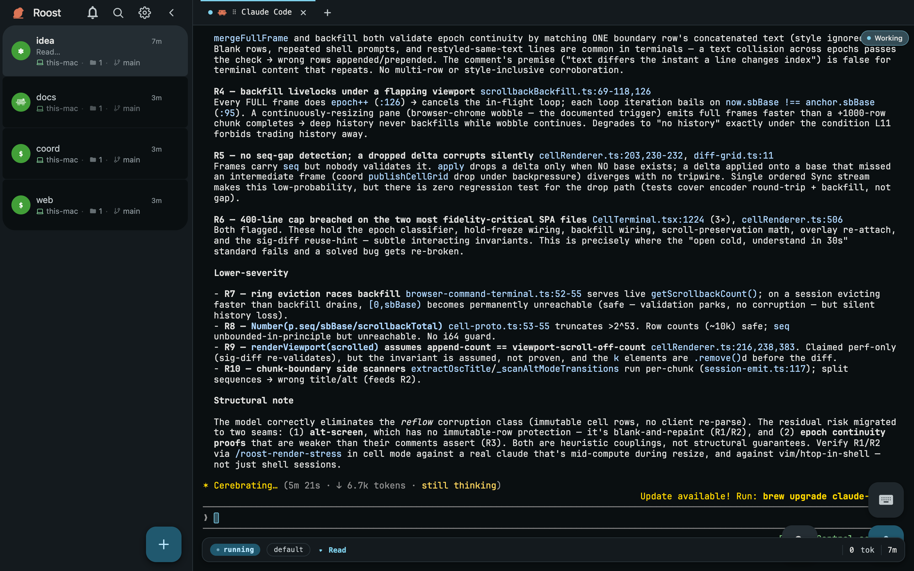
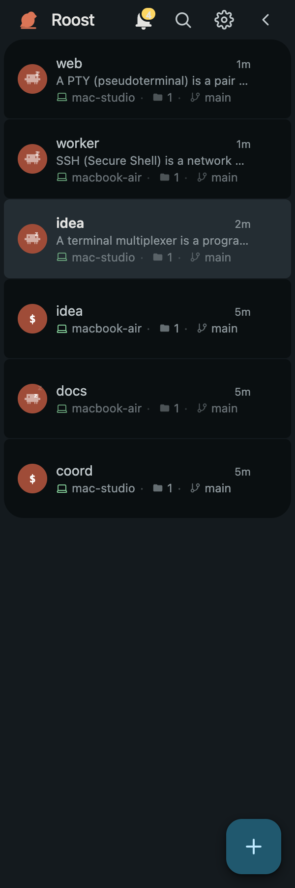

<!-- AUDIENCE: human -->
<div align="center">


# Roost

**One control panel for every Mac you own.**

Roost is a self-hosted, Bun-powered terminal control plane. One Mac can host the coordinator and work as a worker itself; add every other Mac as a worker. Your main laptop, old MacBooks, and other Macs become one agent fleet you can control from a laptop, tablet, or phone.

_I built Roost for my own daily workflow: real infrastructure, not a demo._

[](LICENSE)


</div>



## What it is

One coordinator connects every Mac you own into one fleet, and the coordinator Mac can be a worker too. Add spare or older MacBooks, spread agent workloads across them, and manage every session from the same control panel. Pick a folder on any machine, open a workspace there, and the process runs on that machine while its native terminal stays available on every device you use.

OMP supplies the structured agent state in the sidebar: working, approval-needed, and idle. Any agent, shell, REPL, or TUI still works as a terminal session with its native behavior.

## The problem

Once you have agents across several Macs, spare machines often sit unused while the main laptop carries the CPU and RAM load. "Remote" means SSH, separate terminals, and hunting for the session that needs you. Roost turns those Macs into workers, puts every session in one place, and lets you put the work on the machine that has capacity.

## Three ways I use it

**Leave the heavy work at home.** Have old MacBooks or spare Macs sitting around? Add them as workers, choose the project folder on each one, and put the heavy agent runs there. Their CPU and RAM carry the workload while your main MacBook stays light enough to take with you. Roost keeps all of those sessions in the same control panel, so working from a different machine does not mean juggling a different workflow.

**Take only a tablet.** Roost is a fully functional web app, not a cut-down remote viewer. Pair an iPad or Android tablet, add a keyboard, and you get the same terminal, pane layout, and shortcuts as the desktop surface. The work still runs on your workers at home; the tablet is simply another way into the same sessions.

**Only have your phone?** The same fully functional web app runs on iPhone and Android. Start a terminal in a worker's folder, select terminal text by touch, use the on-screen key row, attach a file, or dictate a prompt with the microphone. The phone UI uses Material 3 patterns, including swipeable terminal cards and touch gestures, so it remains practical when the phone is the only device you have.

## What you get

**Agent sessions are a real UI, not a terminal.** Pick a server and a folder and Roost runs oh-my-pi as a child process, streaming its transcript straight into the browser: messages, tool cards, and approval prompts you answer with a button. Shell sessions stay a full native terminal, and remain the escape hatch for everything else.

**Build a fleet from Macs you already own.** Connect every Mac to one coordinator, then use each one as a worker, including the coordinator Mac. Put an agent run on an older MacBook, a spare desktop, or your main laptop, based on where you have CPU and RAM available. Pick a project folder on that worker and open a workspace there. Workers dial outbound only, so they do not expose an inbound port. The sidebar groups every live session by the machine it runs on, so the entire fleet stays legible in one browser tab.



**A full terminal on every device.** The same fully functional web app runs on desktop, iPhone, Android phones, iPads, and Android tablets. It renders the real persistent PTY with full ANSI, colors, and scrollback. Upload files into a session, download files from a worker to your browser, and use the terminal without caring which Mac runs it. Tablets keep the desktop layout, panes, and shortcuts. Phones add touch selection, an on-screen key row, and gestures for real work. Add it to your home screen and it installs as a standalone PWA with its own icon and no browser chrome.


**Open a workspace wherever the work is.** No more `cd`-ing around over SSH to find a project. Browse any machine's folders as a visual grid, drill in, and hit *Open terminal here*. A new workspace starts in that directory, on that machine. Every folder on every computer you own is a couple of clicks away in the same UI.


**Split the screen into as many terminals as you want.** A workspace isn't just one terminal. Split it right or down (⌘D / ⌘⇧D) into a tiled grid of live panes, drag the dividers to resize, or pick an arrange preset (Grid, Columns, Rows, Main + stack, or Equalize) to fill the space evenly. Every pane is a full session, and the layout follows you to every device.


**Talk to your terminal.** Tap the mic and dictate straight into a session. The transcript is typed in as real input and sent, with no review step in between. It works with zero setup using your browser's built-in speech recognition, though that's a rough fallback. For dictation that's actually good, add a Deepgram API key (Settings → Voice). That's the recommended path, with much higher accuracy and multi-language support, and the key is stored once on the coordinator and shared across every device. It's especially handy on a phone, where typing a long prompt is a chore.

**Sessions that don't die.** PTYs run in a keeper subprocess that outlives worker restarts. Drop WiFi, close the laptop, refresh, or reopen the same session on another machine, and the process is still running with full scrollback. Sessions are event-sourced and the byte stream is resumable from an offset, so reconnects splice back cleanly, with no loss and no duplication.

**The terminal IS the UI.** Raw terminal output renders in a real WASM VT terminal (`@wterm/dom`) with full ANSI and scrollback. Structured OMP state arrives through the local bridge, while the PTY remains the authoritative interactive surface.

**Yours, not a SaaS.** It runs on your hardware over your own network. Auth is an EdDSA JWT minted in the browser with WebCrypto, and the private key lives in IndexedDB and is never sent to the coordinator. There are no shared tokens, no accounts, and no telemetry. Revoke a device by deleting a row.

## How it works

```text
   Browser  (any device on your network)
      │   Connect-RPC over HTTP/2, protobuf binary
      │   terminal bytes · agent events · all state, one connection
      ▼
 ┌─────────────────────────┐
 │ Coordinator  (Bun)      │   event-sourced SQLite · auth · session registry
 │ one machine · port 4102 │   fans live updates out to every open browser
 └───────────┬─────────────┘
             │   raw WebSocket · protobuf frames · worker dials outbound
   ┌─────────┼───────────────────┐
   ▼         ▼                   ▼
 Worker    Worker              Worker        (Bun, one per machine)
 Mac A     Mac B               Mac C
   │  a keeper subprocess hosts every PTY and outlives worker restarts;
   │  agent sessions run one `omp --mode rpc-ui` child process each
```

The coordinator handles control and fan-out only. It holds an append-only event log that every session is projected from, so the browser and the server agree on state by replaying the same events rather than mirroring a snapshot. Workers are outbound-only: they dial the coordinator, never the reverse. For the full tour, see [`ARCHITECTURE.md`](ARCHITECTURE.md).

## Structured agent state

Roost's supported structured integration is **oh-my-pi / OMP**, run as one
`omp --mode rpc-ui` child process per agent session. The worker projects that
RPC event stream into transcript entries the browser renders natively, so tool
calls and approval requests are structured data rather than scraped screen
text. Other terminals, shells, REPLs, and TUIs remain first-class sessions with
their native terminal behavior but no structured sidebar state.

## Network

Roost talks over whatever network your devices share. It's built and tested on [Tailscale](https://tailscale.com), which gives every device a stable name and connects your phone with no port-forwarding, and that's the recommended path. A Tailscale alternative (WireGuard, Headscale, ZeroTier, and the like) or a plain LAN works too, as long as your browser and the coordinator can reach each other. A few conveniences that resolve a machine's tailnet name, like one-click Screen Sharing and Open in Finder, are Tailscale-specific.

## Install

Roost runs on macOS today. It needs a shared network (Tailscale recommended) and OMP on each Mac where structured agent state is required. On the Mac you want as the coordinator:

```sh
curl -fsSL https://raw.githubusercontent.com/cefege/roost/main/install.sh | bash
```

That installs Bun if needed, gets the code, starts the coordinator and a local worker, and opens Roost in your browser already signed in. There are no tokens to copy.

Two things make growing your fleet painless, with no SSH and no tokens to hand-copy:

- **Add a phone or tablet by QR.** In **Settings → Pair a device**, scan the QR with your phone's camera. It opens Roost and signs itself in, with nothing to type.
- **Add another Mac with one line.** Run `roost add-mac` on the coordinator (or **Settings → Machines → Add machine**) and paste the one-liner it prints on the new Mac. It self-installs and registers over the network, as a pull rather than a push.

The full walkthrough, covering pairing devices and adding machines, is in [`GETTING_STARTED.md`](GETTING_STARTED.md).


## Roost vs. driving agents from the cloud

Claude on the web and on your phone is a control plane too, but it drives Anthropic-hosted cloud sandboxes, or a single local machine tethered with `claude rc`. You can't reach a *new* terminal on your own computer on demand: away from your desk you're limited to the sandboxes and sessions already running, and only Claude Code runs there. Roost inverts that. It's a control plane **you** own, talking to as many of **your** machines as you like, with no third party in the loop.

|   | Claude on the web / phone | Roost |
|---|---|---|
| **What it drives** | Anthropic-hosted cloud sandboxes, or one local Mac tethered via `claude rc` | Every Mac you own, natively |
| **Open a new terminal while away** | No; limited to sandboxes or sessions already running | Yes; open a fresh terminal in any folder on any machine, from your phone |
| **What runs in it** | Claude Code only | Any agent, shell, REPL, or TUI |
| **Where your code lives** | A cloud VM (or the one tethered Mac) | Your own hardware, your own network |
| **The surface** | A chat window onto the agent | The real terminal, with full ANSI, scrollback, and touch |
| **Hosting** | SaaS, tied to an account | Self-hosted, no account, no telemetry |

Your Mac's browser stays perfectly usable for claude.ai. Roost isn't a replacement for it; it's the piece the cloud can't be, which is native control of your own fleet from anywhere.

## Roadmap

- **Headless servers**, so you can run workers on always-on boxes and not just laptops, and heavy jobs live on the machine that should own them.
- **Windows and Linux.** The worker and coordinator are Bun; the cross-platform desktop shell is scoped (`FEATURES/PLAN-NEUT.md`), and macOS ships first.
- **Multi-user.** The schema already models multiple operators; a UI for it is next.

## Status

Early, and honest about it. I use Roost every day as my primary coding surface, so the paths I hit are solid. Paths I don't may be rough.

- macOS only today (uses macOS PTYs and LaunchAgents)
- Needs a shared network (Tailscale tested) plus at least one supported agent (Claude Code, pi, or oh-my-pi)
- Single-user today; the schema is built for multiple operators but there's no UI for it yet

## Built with

- **Web:** Solid + Vite, `@connectrpc/connect-web`, `@wterm/dom` (WASM terminal core)
- **Coordinator:** Bun, Connect-RPC + protobuf, Kysely + `bun:sqlite`, event-sourced session log, EdDSA-JWT auth
- **Workers:** Bun, native PTYs via `Bun.spawn`, hook + screen-scrape adapters for agent state
- **Transport:** Connect-RPC (browser↔coordinator), protobuf-over-WebSocket (worker↔coordinator)

## Built by

I'm Mihai — I build and run Roost solo, and it's my daily coding surface. That's why the hard parts are real rather than demo-deep: an event-sourced coordinator that projects every session from an append-only log, outbound-only workers that never expose an inbound port, a custom Connect-RPC and protobuf transport, a resumable byte stream that reconnects with no loss and no duplication, a WASM VT terminal that renders full ANSI on a phone, and self-hosted EdDSA-JWT auth with a private key that never leaves the browser.

Reach me on [GitHub](https://github.com/cefege) or [LinkedIn](https://de.linkedin.com/in/mihai-mateias).

## License

GPL-3.0-only. See [`LICENSE`](LICENSE).
