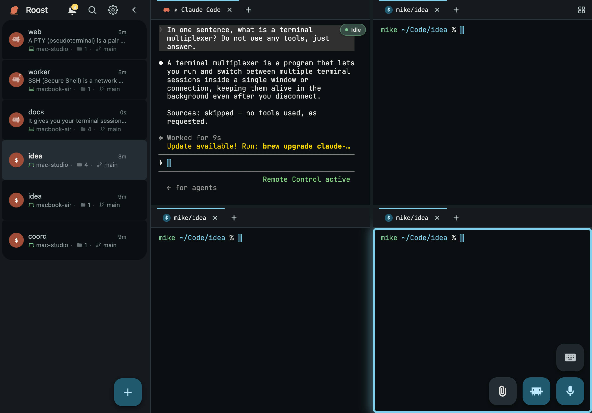
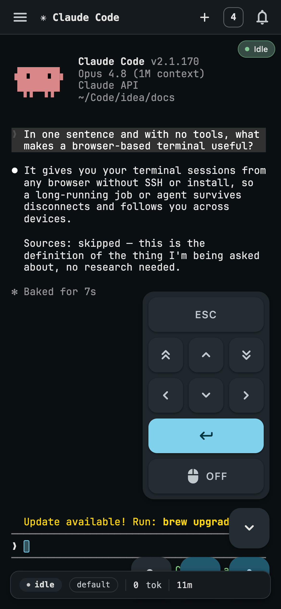
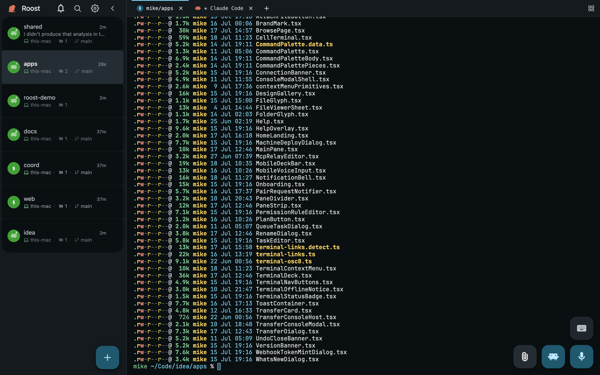
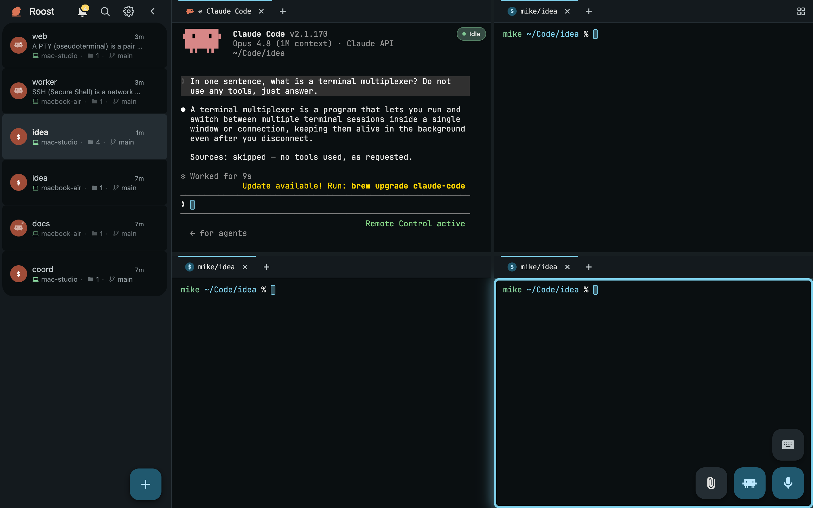
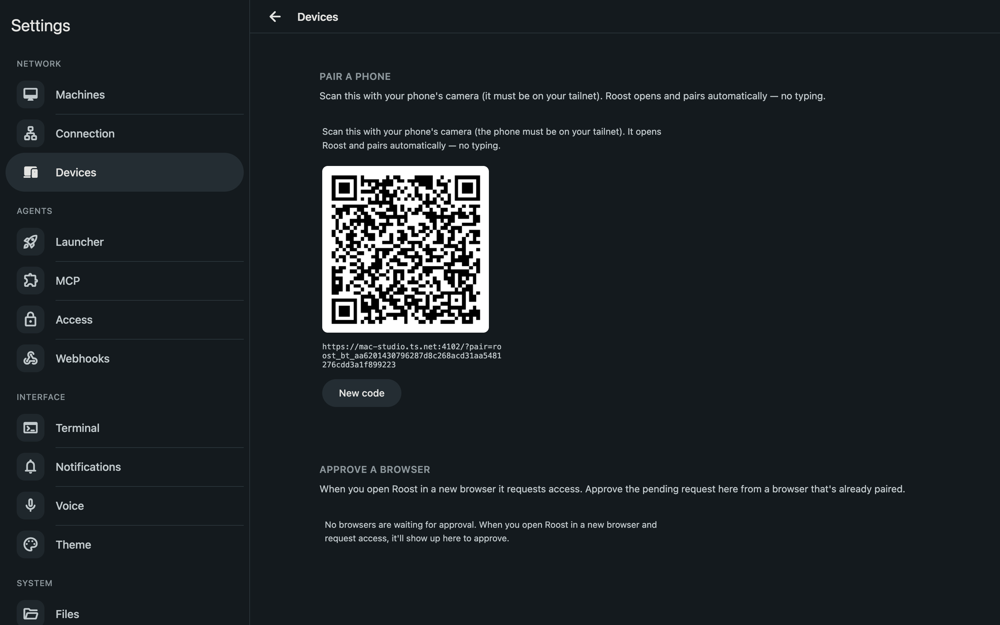

<!-- AUDIENCE: human -->
<div align="center">


# Roost

**One control panel for your terminal fleet.**

Roost is a self-hosted, Bun-powered terminal control plane. One macOS or Linux
machine hosts the coordinator and works as a worker itself; add other macOS or
Linux machines as workers. Control the whole fleet from a laptop, tablet, or
phone.

**v0.5.0 publishes macOS arm64/x64 and Linux arm64/x64 host binaries.**
Windows host releases are paused, but a Windows device remains fully supported
as a browser client alongside macOS, Linux, iPhone, Android, and tablets.

_I built Roost for my own daily workflow: real infrastructure, not a demo._

[](LICENSE)


</div>


## What it is

One coordinator connects every supported machine you own into one fleet, and
the coordinator machine can be a worker too. Add spare or older MacBooks, a
Mac mini, or a Linux box, spread agent workloads across them, and manage every
session from the same control panel. Pick a folder on any machine, open a
workspace there, and the process runs on that machine while its terminal stays
available on every browser device — including a phone or tablet.

Every session is a shell PTY rendered in the browser. Launch any agent CLI, shell, REPL, or TUI inside it and use that program's native terminal interface. Roost never spawns, supervises, or owns an agent session; the CLI remains an ordinary command in its shell PTY.

## The problem

Once you have agents across several machines, spare hardware often sits unused while the main laptop carries the CPU and RAM load. "Remote" means SSH, separate terminals, and hunting for the session that needs you. Roost turns those machines into workers, puts every session in one place, and lets you put the work on the machine that has capacity.

## Three ways I use it

**Leave the heavy work at home.** Have old MacBooks, a spare Mac mini, or a
Linux box sitting around? Add them as workers, choose the project folder on
each one, and put the heavy agent runs there. Their CPU and RAM carry the
workload while your main laptop stays light enough to take with you. Roost
keeps all of those sessions in the same control panel, so working from a
different device does not mean juggling a different workflow.

**Take only a tablet.** Roost is a fully functional web app, not a cut-down remote viewer. Pair an iPad or Android tablet, add a keyboard, and you get the same terminal, pane layout, and shortcuts as the desktop surface. The work still runs on your workers at home; the tablet is simply another way into the same sessions.

**Only have your phone?** The same fully functional web app runs on iPhone and Android. Start a terminal in a worker's folder, select terminal text by touch, use the on-screen key row, attach a file, or dictate a prompt with the microphone. The phone UI uses Material 3 patterns, including swipeable terminal cards and touch gestures, so it remains practical when the phone is the only device you have.

## What you get

**Run any terminal program.** Pick a server and folder, open a terminal, and launch `omp`, Claude Code, Codex, a shell, a REPL, or any other TUI. Roost keeps the PTY alive and renders the program's own terminal interface on every device.

**Build a fleet from the machines you already own.** Connect your macOS and
Linux hosts to one coordinator, then use each one as a worker, including the
coordinator machine. Put an agent run where CPU and RAM are available, pick a
project folder on that worker, and open a workspace there. Workers dial
outbound only, so they do not expose an inbound port. The sidebar groups every
live session by machine, so the fleet stays legible in one browser tab.


**A full terminal on every device.** The same web app runs in any modern
browser — macOS, Windows, and Linux desktops, iPhone, Android phones, iPads,
and Android tablets. Nothing is installed on the device you browse from.
Roost renders ANSI, colors, and retained scrollback; uploads files into a
session and downloads files from a worker. Tablets keep the desktop layout,
panes, and shortcuts. Phones add touch selection, an on-screen key row, and
gestures. Add it to your home screen for a standalone PWA with its own icon.





**Open a workspace wherever the work is.** No more `cd`-ing around over SSH to find a project. Browse any machine's folders as a visual grid, drill in, and hit *Open terminal here*. A new workspace starts in that directory, on that machine. Every folder on every computer you own is a couple of clicks away in the same UI.



**Split the screen into as many terminals as you want.** A workspace isn't just one terminal. Drag a tab onto the edge of a pane to split right, left, up, or down, drag the dividers to resize, or hit the Arrange button for a preset (Grid, Columns, Rows, Main + stack, or Equalize) that fills the space evenly. On a Mac keyboard there are accelerators for all of it — ⌘D / ⌘⇧D to split the focused pane, ⌘⌥G/E/R/V/B for the presets — and ⌃1–9, ⌃⌥arrows, and ⌃⌥T work the same on Ctrl keyboards. Every pane is a full session, and the layout follows you to every device.



**Talk to your terminal.** Tap the mic and dictate straight into a session. The recognized text is typed in as real input and sent, with no review step in between. It works with zero setup using your browser's built-in speech recognition, though that's a rough fallback. For dictation that's actually good, add a Deepgram API key (Settings → Voice). That's the recommended path, with much higher accuracy and multi-language support, and the key is stored once on the coordinator and shared across every device. It's especially handy on a phone, where typing a long prompt is a chore.

**Sessions that survive ordinary disconnects.** A keeper subprocess normally
keeps each PTY alive across worker restarts and retains a bounded 1 MiB raw
history window per channel for adoption. Open, close, and respawn events enter
a crash-safe SQLite outbox, replay one at a time, and leave only after an exact
coordinator ACK. Browsers consume authoritative cell snapshots and deltas;
sequence gaps trigger an in-place rebaseline or Sync redial rather than a
silent splice or page reload. Retained history is bounded, not an unlimited
lossless byte log.


**See which agent needs you.** Every terminal running a coding agent carries one
state — working, needs input, or done — on its sidebar row, tab, mobile card,
and folder rollup (`2 working · 1 needs input`). Plain shells stay unmarked.
OMP and Pi report their own lifecycle, including "waiting on you"; other agents
are detected from what their terminal shows. When a background agent stops for
input or finishes, you get a toast, an unseen count in the tab title, and —
after you grant permission in Settings → Notifications — a real OS notification
on your phone or laptop that opens straight to that session. Nothing about
status is stored: restart anything and it re-derives itself.

**The terminal is the only interactive surface.** Every session owns a PTY.
The worker feeds its output through the `@wterm/core` WASM terminal model and
ships cell snapshots/deltas; the browser paints that authoritative grid. The
program itself remains an ordinary agent CLI, shell, REPL, editor, or TUI.

**Yours, not a SaaS.** It runs on your hardware over your own network. Coordinator startup automatically owns one internal local tenant (`local@roost.invalid`, a `personal` organization, and its `default` dashboard); there is no tenant-bootstrap command or login account to provision. Browser auth is an EdDSA JWT minted with WebCrypto, and the private key lives in IndexedDB and is never sent to the coordinator. There are no shared bearer tokens and no telemetry. Revoke a device by deleting a row.

The managed per-account container, authentication gateway, and
dashboard-isolation implementation also pass the mandatory four-file
qualification profile, but they are **not publicly launched** in v0.5.0. No
production managed containers run, no managed image is published, and the
shared dashboard route is not active. Accounts remain operator-created;
production email signup and Google auth are off.

## How it works

```text
   Browser  (any device that can reach the selected HTTPS origin)
      │   unary Connect-RPC over HTTPS
      │   protobuf Sync WebSocket: events, terminal cells, views, input
      ▼
 ┌─────────────────────────┐
 │ Coordinator  (Bun)      │   event log + transactional projection · auth
 │ one machine · HTTPS     │   dashboard-scoped Sync and terminal fan-out
 └───────────┬─────────────┘
             │   protobuf WebSocket · worker dials outbound
      ┌──────┴───────────────┐
      ▼                      ▼
 Worker                   Worker        (Bun, one per macOS/Linux host)
      │   keeper subprocess owns each PTY across worker restarts
```

The coordinator atomically stores each accepted session event with its
projection. On reconnect, a worker replays durable lifecycle rows, publishes
one authoritative membership snapshot, then enters live delivery. A browser
reconnect folds ordered event backfill and uses guarded current-state snapshots
when cold start or recovery requires them. Workers remain outbound-only. For
the full tour, see [`ARCHITECTURE.md`](ARCHITECTURE.md).


## Network

Quickstart supports two production coordinator modes:

- **Automatic Tailscale Serve (no endpoint flags).** Quickstart discovers the
  coordinator's MagicDNS name, keeps coordinator HTTP on loopback port 4103,
  and configures Tailscale Serve HTTPS on port 4102. Browsers and workers using
  this route join the tailnet.
- **Direct HTTPS (all three endpoint flags).** Coordinator quickstart does not
  call Tailscale. Bun listens on the explicitly selected port and terminates
  HTTPS with the supplied certificate. You provide DNS, routing, firewall
  policy, and a chain trusted by every client.

Direct mode is Tailscale-free for the coordinator, its installed local worker,
and browser access. The current POSIX extra-worker join script still performs a
Tailscale preflight, and the CLI enrollment generator is automatic-mode-only.

**[Cloudflare browser access](GETTING_STARTED.md#optional-cloudflare-browser-access-for-automatic-mode)
is optional.** It layers browser access onto automatic mode: browsers enter
through Cloudflare Access/Tunnel while coordinator-worker traffic remains on
Tailscale. Only the coordinator runs `cloudflared`.

## Install

Roost v0.5.0 publishes coordinator/worker binaries for macOS arm64/x64 and
Linux arm64/x64. POSIX hosts use launchd or `systemd --user`; browsing devices
need only a modern browser. The installer checks the binary against its GitHub
Release SHA-256 sidecar.

Choose one quickstart mode. Automatic Tailscale mode needs no endpoint flags:

```sh
curl -fsSL https://raw.githubusercontent.com/cefege/roost/main/install-binary.sh | bash
"$HOME/.local/bin/roost" quickstart
```

For direct HTTPS, pass the three endpoint flags together:

```sh
"$HOME/.local/bin/roost" quickstart \
  --coordinator-url "https://roost.example.com:8443" \
  --tls-cert "$HOME/.config/roost/tls/fullchain.pem" \
  --tls-key "$HOME/.config/roost/tls/privkey.pem"
```

The URL is an HTTPS origin with an explicit numeric port, no credentials,
query, fragment, or non-root path. Certificate and key paths are absolute,
readable, non-symlink regular files that resolve to distinct files. The
certificate must match the hostname and be trusted by every client. See
[`GETTING_STARTED.md`](GETTING_STARTED.md) for the full contract.

Windows host releases are paused: v0.5.0 publishes no Windows coordinator,
worker, installer, join script, or update path. Windows remains supported as a
browser client.

For source development only, `curl -fsSL https://raw.githubusercontent.com/cefege/roost/main/install.sh | bash` installs Bun and a checkout that tracks `main`; it is not the pinned production release path.

Quickstart sends its one-shot `#pair` fragment directly to the local browser
opener and never prints or logs the secret. The fragment is absent from HTTP
requests and `Referer` headers. If the opener fails, fix the local opener and
rerun quickstart, or pair from an already authorized browser; never move an
enrollment secret through shell history, chat, logs, or screenshots.

Two enrollment surfaces avoid copying long-lived credentials:

- **Add a phone or tablet by QR.** In **Settings → Pair a device**, scan the QR
  with the device camera. It opens Roost and signs itself in.
- **Add a macOS/Linux worker.** **Settings → Machines → Add machine** uses the
  configured coordinator origin in either mode; the `roost add-machine`
  generators are automatic-mode-only. Paste the one-shot command on the new
  host. The current POSIX join script still requires a running Tailscale daemon
  even for a direct origin, so v0.5.0 has no Tailscale-free extra-worker
  enrollment path.

The full walkthrough is in [`GETTING_STARTED.md`](GETTING_STARTED.md).



## Roost vs. driving agents from the cloud

Claude on the web and on your phone is a control plane too, but it drives Anthropic-hosted cloud sandboxes, or a single local machine tethered with `claude rc`. You can't reach a *new* terminal on your own computer on demand: away from your desk you're limited to the sandboxes and sessions already running, and only Claude Code runs there. Roost inverts that. It's a control plane **you** own, talking to as many of **your** machines as you like, with no third party in the loop.

|   | Claude on the web / phone | Roost |
|---|---|---|
| **What it drives** | Anthropic-hosted cloud sandboxes, or one local Mac tethered via `claude rc` | Every macOS or Linux worker you own, natively |
| **Open a new terminal while away** | No; limited to sandboxes or sessions already running | Yes; open a fresh terminal in any folder on any registered worker, from your phone |
| **What runs in it** | Claude Code only | Any agent, shell, REPL, or TUI |
| **Where your code lives** | A cloud VM (or the one tethered Mac) | Your own hardware, your own network |
| **The surface** | A chat window onto the agent | The real terminal, with full ANSI, scrollback, and touch |
| **Hosting** | SaaS, tied to a login account | Self-hosted, automatic local tenant, no login account or telemetry |

Your desktop browser stays perfectly usable for claude.ai. Roost isn't a replacement for it; it's the piece the cloud can't be, which is native control of your own fleet from anywhere.

## Roadmap

- **Headless-server polish.** Linux workers already install as a
  `systemd --user` unit with linger; setup for a box reached only over SSH
  remains.
- **Tailscale-free direct enrollment.** Direct coordinator quickstart already
  avoids Tailscale, but the current POSIX worker join front door still requires
  a Tailscale preflight.
- **Multi-user self-hosting.** v0.5.0 automatically provisions one local
  tenant; broader self-hosted operator administration remains outside this
  release.
- **Public managed launch.** Per-account isolation is qualified, while image
  publication, dashboard activation, and production signup remain off.

## Status

The v0.5.0 release boundary is explicit:

- **Hosts:** macOS arm64/x64 and Linux arm64/x64. Windows host support is
  paused; Windows remains supported as a browser client.
- **Networks:** automatic Tailscale Serve or direct HTTPS. The current
  extra-worker join path is still Tailscale-gated.
- **Deployment:** self-hosted macOS/Linux is released and deployed. Managed
  per-account isolation is qualified, not publicly launched; accounts are
  operator-created and production signup, Google auth, image publication, and
  dashboard activation remain off.
- **Beta surfaces:** global search is unavailable; use sidebar filtering or
  per-terminal find. Cross-worker file transfer is unavailable; use `rsync` or
  `scp` in a terminal.

## Built with

- **Web:** Solid + Vite, `@connectrpc/connect-web`, and a canvas cell-grid
  renderer
- **Coordinator:** Bun, Connect-RPC + protobuf, Kysely + `bun:sqlite`,
  transactional event projection, EdDSA-JWT auth
- **Workers:** Bun, native PTYs via `Bun.spawn`, `@wterm/core`, keeper
  subprocesses
- **Transport:** unary Connect-RPC plus a protobuf Sync WebSocket
  (browser↔coordinator), protobuf WebSocket (worker↔coordinator)

## Built by

I'm Mihai — I build and run Roost solo, and it is my daily coding surface.
That is why the hard parts are real rather than demo-deep: a crash-safe
lifecycle outbox, atomic coordinator event projection, outbound-only workers,
keeper-owned PTYs, generation-addressed terminal cells that repair gaps in
place, and self-hosted EdDSA-JWT device auth whose private key never leaves the
browser.

Reach me on [GitHub](https://github.com/cefege) or [LinkedIn](https://de.linkedin.com/in/mihai-mateias).

## License

GPL-3.0-only. See [`LICENSE`](LICENSE).
