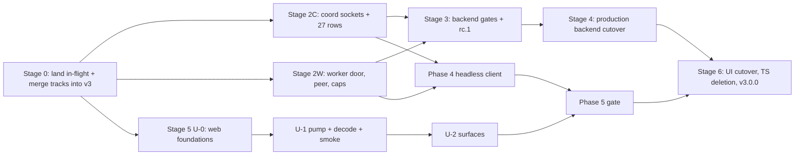

# Roost v3 — full parity with v2, then production cutover

## Context

Ask: finalize the Rust rewrite (branch `v3`) so it has **full behavioural parity with the Bun/TypeScript Roost (v2, `main`)**, then run production on it. Parity is judged by the v2 oracle that already exists: the Playwright suite under `smoke/terminal/` (70 specs; TS baseline 142 passed / 0 failed / 3 skipped correctness + 15/0/3 perf, `docs/v3-gate-baselines.md` "Phase gates") and the 11 in-scope rows of `FEATURES/README.md` "v0.5.0 release boundary" (10 SHIPPED + Global search QUALIFIED; the 2 PAUSED rows are out of scope).

End state: every Rust gate green on `v3`; the Playwright oracle passes at the TS baseline with **all three** executables Rust (`ROOST_SMOKE_COORD_EXECUTABLE`, `ROOST_SMOKE_WORKER_EXECUTABLE`, `ROOST_SMOKE_WEB_DIST`) on Chromium and Firefox; production `https://mike.roosttt.com` runs the Rust coord + worker + CLI + Dioxus UI; TS product code deleted; `v3.0.0` tagged and `main` fast-forwarded.

## Decisions

Chosen earlier by the user (unchanged):
- **Staged cutover, Rust backend first.** Production switches to Rust coord + worker + CLI serving the v2 web bundle once Stage 3 passes; the Dioxus UI replaces the bundle after the Phase 5 gate; TS is deleted last.
- **One-time import of v2 state** (`roost import-v2`, implemented). **Parallel hostname, then flip** (`mike-v3.roosttt.com`, kept as a permanent alias; a two-level name such as `v3.mike.roosttt.com` fails the TLS handshake, because Cloudflare's universal certificate covers `*.roosttt.com` only).

Fixed by this plan (user-overridable, see Assumptions):
- **Parity rule: v2 behaviour wins wherever port and v2 disagree** — including where v2 has a known imperfection. A deliberate improvement over v2 is out of scope for this plan. Applied below to the send-queue ignore.
- **DOM oracle = Playwright only.** No `wasm-bindgen-test` tier is added. Consequence enforced in every web slice: any logic inside a `#[cfg(target_arch = "wasm32")]` file is limited to web-sys calls; bookkeeping, counters, state machines live in target-independent types with native `#[test]`s (the `open_count` fix in U-0 is the worked example).
- **The Rust bundle implements v2's `window.__smoke` contract in full** (`SmokeApi`, `apps/web/src/smoke/smokeTypes.ts:118-287`, 53 members, counted at `v3-web@04c93348`; an earlier count here said 56, and the "52 reached" figure below predates that recount — those 52 are reached by `smoke/terminal/*.spec.ts` directly or through its helper `.ts` files), behind the existing `smoke` cargo feature of `roost-web`, so the unmodified oracle drives the Rust UI.
- **File-size policy: 400 lines counting all lines**; `xtask/file-size-baseline.json` is `{}` — every `.rs` over 400 except the exempt `roost-coord/src/rpc/service_impl.rs` is a lint failure. Never re-pack lines to fit.

## Measured state (2026-09-29)

| Area | State | Evidence |
|---|---|---|
| `v3` | `b28005c0`, clean. Contains Stage 1 (CLI green), 2L and 2R: 27 subcommands incl. `update` (tag-filtered `v3.`, `update/release.rs:53-59,103-126`), `import-v2`, `deploy --release`/`--web-dist`, `quickstart --web-dist`, logrotate (`services/logrotate.rs`). `release.yml` exists (verify/smoke/build ×4 triples/web/publish); its web job still builds TS `apps/web` (`:168-171`). No `v3*` tag. Phase-gates section exists; S3.0 recorded NOT GREEN (lint 8, keeper — cleared by the worker merge) | scout `IntegNow` |
| Track branches vs `v3` | `v3-coord` +30/−194; `v3-worker` +66/−121; `recover/workerroot` (worker lead's live branch, HEAD `5188adf`) +85/−121; `v3-web` +35/−16 | `git rev-list --count` |
| Trial merge | `/tmp/roost-merge-trial2` @ `a3932bcc` (v3 + v3-worker 57bd7f74 + v3-coord c79d7d4a + v3-web 8d9c1f88): zero conflicts; `xtask lint` 2814 inputs, 4 violations, all size | integrator |
| Coord (`v3-coord@c79d7d4a`) | **No socket carries traffic.** `http/upgrade.rs:97-110` (`/ws/coord-worker/{fp}`) and `:177-185` (`/ws/coord-sync`) answer 401 on `Admitted`; the sync handler hard-codes `tab/since/flow/sync_v: None` (`:137-140`). `worker_link/{connection,frame_queue,keepalive,conn_types,frame_dispatch,dispatch,dispatcher_for,handshake,live_frames,client_seq}.rs` exist; `connection.rs::serve_socket` (`:166`) has no caller, `frame_from_bytes` returns `None` (`:383-385`), outbound arm open (`:9-15`). `sync_ws/{socket,driver,seed,v1_delivery,v1_seed,ui_settle}.rs` absent; `take_flush_request` (`session.rs:246`) has no caller; `take_next_sendable` is called only from tests. 27 `AwaitingDomainPort` rows (below). `SessionsRuntime`/`AttachmentsRuntime`/`GlobalSearchRuntime`/`DeployRuntime` are unit structs. Done: SPA (`http/spa.rs` + `roost-host/src/spa_path.rs`), real terminal seams (`serve.rs:246-266`), `/api/db-export` real, MCP busy-timeout → `Unavailable`. One `#[ignore]` (`tests/sync_v2_send_queue.rs:385`). Over cap: `attachments/files.rs` 596, `tests/sync_v2_send_queue.rs` 447, `tests/event_publication.rs` 406 | scout `CoordNow`, direct reads |
| Coord awaiting rows (27) | workers: `WorkersDeployStart/Output` (`method_route_rows.rs:42-43`); sessions: `SessionsList/Spawn/Attach/Kill/Rename/Input/CursorPos/AssignWorkspace` (`:79-86`), `SessionsGrantLocalTerminal`, `SessionsNegotiateLocalTerminalPeer` (`:90-91`); agents: `SessionsPrompt` (`:120`); search: `SessionsSearchGlobal`, `SessionsCancelGlobalSearch` (`:131-132`); attachments: `SessionsNegotiateAttachmentPeer, FilesRead, FilesReadChunk, FilesListDir, FilesMkdir, AttachmentsGrantDirect, AttachmentsDirectStatus, AttachFileChunk, AttachmentProbe, ListAttachments, DeleteAttachment` (`:138-148`; `attachments/files.rs` already implements the Files*/Attach*/Probe/List/Delete bodies); rpc: `DiagSnapshot` (`:246`) | scout `CoordNow` |
| Worker (`recover/workerroot@5188adf`) | Boot composes end to end (`runtime/boot_sequence.rs`): identity → enroll (`activation.rs`) → `LocalDoor::bind` → sqlx outbox `Journal::open` → `reconcile::admit_keeper` (open-session count, not `None`) → `session_stack::build` → production `Deps` (`runtime/deps.rs:80-100`) → link (`SessionSnapshot`, durable outbox, `CoordinatorCellSink`) → `adopt_survivors` → Readiness → `link.run`. `UNIMPLEMENTED` = 0; `#[ignore]` = 0. Keeper client complete (deferred frames, all six frames, resize outcome). **Gaps**: hello sends `capabilities: Vec::new()` although `advertised()` is computed (`runtime/link_serve.rs:126,134`); local door binds but never accepts — no SPA, no `/local` terminal or attachment sockets (`runtime/door_serve.rs:9-11,129`); `NoSnapshot` still defined (`snapshot_source.rs:180-185`, unused); WebRTC peer unported (`peer/mod.rs` 53 lines vs v2 `terminal/peer/*` + `attachments/attachment-peer-*` ≈4.9k). Over cap: `runtime/adoption.rs` 473, `runtime/boot_sequence.rs` 408, `session/binding.rs` 413, `session/resume.rs` 421, `tests/worker_boot_order.rs` 520 | scout `WorkerNow`, `wc -l` |
| Web (`v3-web@8d9c1f88`) | roost-web 4,288 lines, roost-web-terminal 11,450, roost-client-core 27,841 vs v2 `apps/web/src` 65,282 non-test lines. `App()` renders `GatedApp`; nothing calls `ClientCore::handle` (`core.rs:98`) outside tests; `WebSocketSyncSocket` (`platform/sync_socket.rs:229-263`) never constructed; no `use_effect`/`spawn`; gate stays `Checking`. `surface_for` serves only `Route::Home` (`app.rs:73-89`). No protobuf decode (`sync/inbound.rs` `KNOWINGLY_UNMAPPED_ARMS`, 14 arms). No `__smoke` in src. v2 `components/` with **no** Rust counterpart: Settings (5,127 lines), terminal (4,737), deck (3,135), sidebar (2,137), browse (1,902), pairing (1,880), notifications (1,200), design (890), palette (675), machines (566), search (542), agents (444); plus `MainPane`, `MobileVoiceInput`, `RenameDialog`, `AppErrorBoundary`, `UiBridge`, `contextMenuPrimitives`. Not ported: `voice/` (2,047), `browser/` (1,817), `smoke/` (2,134), `apps/web/public/` assets. `CellGridRenderer` is ported (2,598 Rust lines vs 1,748 TS) but never mounted. client-core: 353 passed / 6 failed; roost-web 81/0; wasm32 build exit 0. No `dist/` ever built (`dx 0.7.10` is installed) | scout `WebNow`, `wc -l` |
| Disk | 14 GiB free of 111 GiB; floor 10 GiB | `df -h` |

## Parity gap map (v2 file → Rust, 2026-09-29; scouts `CoordGap`, `WorkerGap`, `WebStoreGap`)

Every NONE/PARTIAL row is owned by a named slice in Stages 2C, 2W or 5; the slice tables list the v2 files. Totals:
- **Coord**: 18,754 v2 lines not fully ported (13,371 NONE + 3,302 PARTIAL + 2,081 known socket/sync files). Every v2 HTTP route already has a Rust route (`http/listener.rs:204-209`). Largest holes: `terminal/input/*` (1,828; `CommandOutcome::Terminal` has no consumer, `sync_ws/terminal_command.rs:70`), `terminal/direct/*` (1,532; stubs `service_impl.rs:352,362`), `attachments/*` (1,672), `search/*` (1,324), `terminal/capture/*` (1,231), deploy + catch-up, push delivery never installed (`agents/status_push.rs`), no ws auth deadline, no `foreign_key_check`. Ported and not gaps: pairing, audit, rate limits, telemetry, transcription, maintenance, UI layout apply.
- **Worker**: ≈22,169 v2 lines. **`runtime/link_drain.rs:57-138` acts on 4 of v2's 17 downstream frame kinds** (HelloAck, Ping, BrowserCommand, EventAck); input, inputRequest, agentPrompt, terminalStreamState, pipeline/snapshot/view requests, local grant/revoke, keeperUpdatePrepare, attachmentChunk and updateBroker fall into a logging catch-all — there is no browser→PTY input and no coordinator-driven resize. `agents/*` (4,837) essentially absent; no heartbeat; capture never fed; `HostWatchers`/`StrayTracker`/`SyncOutputHold` never created; door never accepts; peer is a 53-line stub.
- **Web**: see Measured state; plus the `WebStoreGap` rows folded into Stage 5.

## Approach

### Execution model (every stage)

- **Roles.** The integrator (top-level session) owns `v3`, `crates/roost-protocol`, `crates/roost-proto`, root `Cargo.toml`/`Cargo.lock`, `xtask/`, `smoke/`, `.github/`, `docs/v3-*.md`, every merge, every phase gate, and the production runbook. One track lead (`task` agent) per track owns its worktree, composition roots, `cargo fmt`, the track gate, commits and pushes (`<area>: <scope>` subject + why-body). Slice agents own disjoint file sets, never commit, never run `cargo fmt` or `--update-*-baseline`, and report any edit outside their files. Worktrees: coord `/home/almalinux/repos/roost-v3-coord` (branch `v3-coord`), worker `/home/almalinux/repos/roost-v3-worker` (branch `recover/workerroot`, pushed to `v3-worker` at Stage 0), web `/home/almalinux/repos/roost-v3-web` (`v3-web`), integrator `/home/almalinux/repos/roost-v3` (`v3`). Every brief says: absolute paths under your own worktree only.
- **Build isolation.** Every cargo command: `export PATH="$HOME/.cargo/bin:$PATH" CARGO_INCREMENTAL=0 CARGO_BUILD_JOBS=2 CARGO_TARGET_DIR=<worktree>/target-track`, wrapped as `flock <worktree>/target-track/.roost-build.lock cargo …`. At most three tracks build at once; Track U yields first. The integrator uses `/home/almalinux/repos/roost-v3/target-gate` with `CARGO_BUILD_JOBS=8`, only when `pgrep -x cargo` is empty. Before every build: if `df --output=avail -B1G /home | tail -1` < 10, stop, `cargo clean` your own `target-track` only, and report.
- **Track gate** = two agreeing green runs of `cargo test -p <track crates> --no-fail-fast` + `cargo clippy --workspace --all-targets -- -D warnings` = 0 + `ROOST_REPO_ROOT=$PWD cargo xtask lint` = 0 violations (always read the **inputs** count beside it) + `cargo xtask fmt` clean confirmed by `git status --short` (the tool's "formatted" is a check, not an action). Copy gate commands from `.github/workflows/ci.yml`; never retype. Green means zero failures; `#[ignore]` is allowed only as `#[ignore = "<slice>: <what>"]` for a planned later slice with the assert unchanged.
- **After any scripted edit the next command is a compile**, never a line count.
- **A guard counts only once it has been seen to fail**: for every new invariant test, mutate the product line it guards, watch the test fail, revert (record the mutation in the commit body).
- **Classify each red test by v2 before touching it**: product defect → fix product; test defect → fix test citing the v2 counterpart; planned later slice → `#[ignore]` as above.
- **"Who consumes this?"** For every new enum variant, flag, returned value, or rendered element, name its production reader in the commit body. A handler for an event nothing in `src/` produces is not coverage (`docs/v3-handoff/silent-no-ops.md`).
- **Snapshot rule** (uncommitted work before a long build): `git add -A && sha=$(git stash create) && git reset -q && [ -n "$sha" ] && git push origin "$sha:refs/heads/<branch>-snap"`, verified with `git ls-remote origin refs/heads/<branch>-snap`. Never the bare `git stash create` form (it deletes the previous snapshot when a new file is present).
- **Slice brief template.** `# Target` (worktree, owned files, v2 files ported, non-goals); `# Read first` (v2 module + its tests, `docs/FAILURE-INDEX.md` grep, track contract: coord `docs/phase3-coord-contract.md`, worker `protocol/spec/{worker-link,keeper}.md`, web `docs/phase4-client-contract.md` + `apps/web/src/smoke/smokeTypes.ts` + CLAUDE.md design system); `# Rules` (≤400 lines incl. inline tests, 3–6 line `//!` header, no `macro_rules!`, no top-level mutable state, no `unwrap`/`expect` outside tests, a `tracing` line per state transition, reuse named seams, no stubs, no empty `pub mod`, no `todo!()`/`UNIMPLEMENTED:`); `# Done` (named ported v2 tests pass; `cargo check -p <crate> --all-targets`).
- **The v2 keeper (pid 2325919) is never killed.**

### Stage 0 — Land in-flight work and merge every track into `v3` (integrator)

1. **Coord lead finishes its current commits** on `v3-coord`, in this order, each compiling before the next:
   - `attachments/files.rs` split (596 → every file ≤ 400), by hand, compile between moves, sized against the post-arm file; then the eight file arms in `rpc/service_impl.rs:859-926` (today `delegated_reply` for `FilesRead, FilesReadChunk, FilesListDir, FilesMkdir, AttachFileChunk, AttachmentProbe, ListAttachments, DeleteAttachment`) call `files_read`, `files_read_chunk`, `files_list_dir`, `files_mkdir`, `attach_file_chunk`, `attachment_probe`, `list_attachments`, `delete_attachment` (`files.rs:161-534`), with those eight rows flipped to `Implemented` in the same commit (ratchet 27 → 19; `tests/method_route_arm_pairing.rs` stays green).
   - The SEND-QUEUE commit (below).
   - `tests/event_publication.rs` 406 → ≤ 400: move `a_snapshot_over_the_cap_is_refused_before_anything_is_written` (`:350-379`) and `bulk_session_id` (`:404-406`) into a new `tests/event_snapshot_cap.rs` (copy any file-local helper it calls; `mod event_support;` as the original does).
2. **SEND-QUEUE ignore — settled by the parity rule, no product change.** Facts read on `v3-coord@c79d7d4a`:
   - `send_queue.rs:100-106` applies the age override to one head per domain; v2 `apps/coord/src/sync/sync-ws-v2-queue.ts:66-95` (`selectV2Candidate`) does the same (`heads.push(...); break;`), with the v2 comment at `:73-74`: "never reorder two eligible items from the same domain".
   - `LastActivity` lands in `SyncDomain::Terminal` (`frame_meta.rs:145` → `session_keyed_meta`, `:180-187`), the same domain as cells.
   - Priority inserts happen only for `meta.attach_snapshot || meta.terminal_state` (`admission.rs:304-307`; producers `ready_ring.rs:184`, `:267`). `terminal_priority_insert_index` (`send_queue.rs:279-294`) is line-for-line v2 `v2TerminalPriorityInsertIndex` (`sync-ws-v2-queue.ts:28-44`).
   - The fixture exercises plain FIFO (the `LATE` cell enqueued before `LastActivity`, same session, same domain), which v2 sends cell-first.
   
   Commit `coord: the aged-out send-queue case asserts v2's head-only override`:
   - Replace the final `take_next_sendable(aged)` assertion with a drain: call `take_next_sendable(aged, &mut hub)` until it yields `Frame::LastActivity` (cap 16 iterations; `panic!` on a non-`Send` step or if never reached), recording each sent frame; assert the `LATE` cell was sent before `LastActivity`. Keep the `DOMAIN_SLOTS == 7` assertion. Rename the test `an_aged_non_cell_waits_behind_eligible_frames_in_its_own_domain`.
   - Delete the `#[ignore]` and the doc paragraphs `:359-384`; replace them with three lines: the override ranks domain heads only, as v2 does (`sync-ws-v2-queue.ts:72-95`); within a domain a non-cell waits behind frames queued ahead of it.
   - `send_queue.rs:9-15`: the header promise says the aged non-cell outranks cells "among domain heads". `frame_meta.rs` `session_keyed_meta`: one doc line that its frames go to `SyncDomain::Terminal`.
   - Move the file-local helpers (`generations`, `context`, `cell_frame`, `opened_event`, `meta_of`, `hydrated_terminal`, `hydrated_uncovered_terminal`, `:40-186`) into new `tests/sync_v2_send_queue_support/mod.rs` (3–6 line `//!` header, `pub(crate)` fns), imported by name exactly as `tests/event_publication.rs:14-18` imports `event_support`. Both files ≤ 400.
   - Check: `cargo test -p roost-coord --test sync_v2_send_queue` → 3 passed, 0 ignored. Mutation: change `send_queue.rs:100-106` to scan the whole domain queue for the oldest aged non-cell → the renamed test fails; revert.
3. **Worker lead finishes F6+F13** on `recover/workerroot` (already committed at `5188adf`: `Searches` ledger on `SessionStack`, pinned by `tests/boot_adoption_gate.rs:290-356`), confirms its mutation (make `deps()` build a fresh `Searches` → the pin fails), then splits the five over-cap files (`runtime/adoption.rs`, `runtime/boot_sequence.rs`, `session/binding.rs`, `session/resume.rs`, `tests/worker_boot_order.rs`) at existing section boundaries, each result ≤ 400 with its own header; compile between moves. Then track gate, then `git push origin recover/workerroot:v3-worker`.
4. **Web lead** lands U-0 (Stage 5) items 1–3 on `v3-web` and passes its track gate (client-core 0 failed with the planned ignores named).
5. **Integrator merges** `v3-worker`, `v3-coord`, `v3-web` into `v3` in that order (a fresh trial merge first in `/tmp/roost-merge-trial3`; the previous trial had zero conflicts), then the workspace gate on `v3`. Record in "Phase gates" as S3.0: lint 0 (inputs ≈ 2800+), clippy 0, fmt clean, `cargo test --workspace --no-fail-fast` two agreeing runs with 0 failed. Then merge `v3` back into each track branch.

### Stage 2C — Coordinator: sockets live, then the 27 rows (`roost-v3-coord`)

Ratchet: `grep -c 'PortStatus::AwaitingDomainPort' crates/roost-coord/src/rpc/method_route_rows.rs` (27 → 0). A row flips to `Implemented` only in the commit whose `service_impl.rs` arm calls the real handler; `tests/method_route_arm_pairing.rs` guards all three directions. Do not fold rows by domain.

**Wave C-B — the keystone (first; everything in Stage 3 waits on it):**

| Slice | Owns | Ports (v2 `apps/coord/src/`) | Done when |
|---|---|---|---|
| **WL-WIRE** | `worker_link/connection.rs` (`frame_from_bytes`, outbound arm), + a new sibling if it would pass 400 | `workers/{worker-conn,worker-ws-handler}.ts` | `frame_from_bytes` decodes the worker-link protobuf (`roost_proto` buffa, as `sync_ws/retained_frame.rs:20-21` does) and returns `None` only for undecodable bytes, logging and closing with the §7.6 protocol-error code; the outbound arm writes queued frames from `frame_queue.rs`. Tests: a hello round-trip over an in-memory duplex; an undecodable frame closes with the table's code |
| **SY2 socket + driver** | new `sync_ws/{socket,driver}.rs`, `sync_ws/mod.rs` `pub mod` list | `sync/{sync-ws-handler,sync-ws-v2-egress,sync-ws-v2-control,sync-ws-client-ingress,sync-ws-v2-state*}.ts` | Exposes `sync_ws::socket::serve_socket(WebSocket, SyncAdmitted, &CoordServices)`. `driver.rs` (1) calls `take_flush_request()` (`session.rs:246`) as the flush trigger; (2) loops `take_next_sendable(now_ms, hub)` (`egress.rs:89`) while it returns `FlushStep::Send`, writing each; (3) consumes `CommandOutcome::DomainReady` (`commands.rs:99`) by triggering a flush turn. `drain_terminal_queue` is NOT the send path (it discards). Installs every feed adapter named in `sync_ws/feed/mod.rs:19-24`. Tests: subscribe → domain_ready → frames flow in order; a client ack releases the window |
| **lead: upgrade** | `http/upgrade.rs` | — | Both `Admitted` arms become `axum::extract::ws::WebSocketUpgrade` → `on_upgrade` into `worker_link::connection::serve_socket` and `sync_ws::socket::serve_socket`, echoing the `sec-websocket-protocol` marker; the sync handler passes the real `tab/since/flow/sync_v` query values instead of `None` (`:137-140`). Test: an admitted upgrade returns 101 |

Check for C-B: release `roost` built, then `ROOST_SMOKE_COORD_EXECUTABLE=<release roost> bun smoke/terminal/live-stack.ts` prints `READY <url> worker=<fp>` (TS worker, TS web).

**Wave C-C — the rows (parallel after C-B is merged into `v3-coord`):**

| Slice | Owns | Ports | Rows |
|---|---|---|---|
| **S4 sessions** | `sessions/{rpc_sessions,spawn,list_projection,pending_rpcs}.rs`; `SessionsRuntime` gains state | `sessions/{handlers-sessions,handler-session-spawn,session-list-projection,pending-spawns}.ts`, `router/pending-rpcs.ts` | `SessionsList/Spawn/Attach/Kill/Rename/Input/CursorPos/AssignWorkspace` |
| **C-DIRECT** | new `terminal_direct/` (replaces the stubs at `service_impl.rs:352,362`) | `terminal/direct/*` (10 files, 1,532) | `SessionsGrantLocalTerminal`, `SessionsNegotiateLocalTerminalPeer` |
| **AT attachments** | `attachments/{grant,peer,chunk_relay,status_results}.rs`; one grant table shared with `AttachmentsDirectStatus` | `attachments/*.ts` | `SessionsNegotiateAttachmentPeer`, `AttachmentsGrantDirect`, `AttachmentsDirectStatus` + any file row Stage 0 did not flip |
| **AG2 prompt** | `agents/{prompt_control,rpc_prompt}.rs` | `agents/{agent-prompt-control,handlers-agent-prompt}.ts` | `SessionsPrompt` (epoch/occupant/revision/process-proof fence) |
| **X2 diag snapshot** | `diagnostics/{diag_snapshot,worker_results,session_state}.rs` | `diagnostics/{worker-diag-snapshot,diag-snapshot-worker-results,diag-snapshot-session-state}.ts` | `DiagSnapshot` |
| **D1 deploy jobs** | `deploy/{jobs,catchup,rpc_deploy,output_stream}.rs`; `DeployRuntime` gains the journal | `deploy/{deploy-jobs,handlers-workers-deploy,worker-catchup-deploy}.ts`, `sse.ts` (deploy output stream), `workers/worker-send-maintenance.ts` (POSIX half); the catch-up runs from the worker-connected hook (`main.ts` `onWorkerConnected`) | `WorkersDeployStart/Output` |
| **GS global search** | `search/{fanout,cursors,cancel}.rs` over `terminal_screen/search_ledger.rs` | `search/*.ts` | `SessionsSearchGlobal`, `SessionsCancelGlobalSearch` |

**Wave C-D (parallel after SY2; not row-bearing, found by the v2→Rust file map — every one is a v2 behaviour the oracle or a FEATURES row depends on):**

| Slice | Owns | Ports (v2 `apps/coord/src/`) | Done when |
|---|---|---|---|
| **SY3 seed/v1** | `sync_ws/{seed,v1_delivery,v1_seed,ui_settle}.rs`; `sync_ws/feed/` subscription engine | `sync/{sync-feed,sync-feed-seed,sync-feed-v1-seed,sync-ws-v1-delivery}.ts`, `ui-state/ui-layout-apply-owner.ts` (contract §8.5 `docs/phase3-coord-contract.md:1602`, incl. the §12.8b announcement fence) | ported v2 tests pass; a reconnect with `since` backfills from the fixed cutoff |
| **C-INPUT** | new `terminal_input/`; the consumer of `CommandOutcome::Terminal` (`sync_ws/terminal_command.rs:70`) inside SY2's driver; a real route-retirement sink replacing `NoRouteRetirement` (`terminal_screen/route_index.rs:41-46`) | `terminal/input/*` (11 files, 1,828) incl. `terminal-route-retirement.ts` | browser input over Sync reaches the worker with v2's accepted/rejected/ambiguous outcomes; ported v2 tests |
| **C-SEND** | `workers/send.rs` | `workers/worker-send.ts` (hop deadline; input, agent-prompt, stream-state, snapshot, attachment-chunk senders) | each sender has a production caller (C-INPUT, AG2, C-SCREEN, AT); hop deadline test |
| **C-SCREEN** | `terminal_screen/{hub_fanout,snapshot_controller,pipeline_cache}.rs`, title snapshot in `worker_link/live_frames.rs` | `terminal/screen/{terminal-screen-hub,terminal-screen-snapshot-controller}.ts`, `terminal/worker-terminal-pipeline-{cache,snapshot}.ts`, `terminal/terminal-title-hub.ts` | socket fan-out of screen frames; a late subscriber receives the retained title. **Ruling on `terminal_view/mod.rs:13-21`** (view-stream controller + stream dispatcher dropped because the owner-mode worker runs the stream): the drop stands iff every `terminal-*` spec passes in Stage 3.2; otherwise port `terminal/view/*` and `terminal/screen/terminal-stream-dispatcher*` here |
| **C-CAPTURE** | new `terminal_capture/` | `terminal/capture/*` (4 files, 1,231) | capture request/relay round-trip with W-CAPTURE |
| **C-PUSH** | `push/transport.rs` production impl (Web Push, VAPID from `app_settings` `push.vapid`), `serve.rs` installs `PushTransitions` via `install_push_delivery` | `push/{push-sender,push-dispatch}.ts` | an idle→blocked agent transition sends one push to a subscribed endpoint (test transport records it); real terminal-viewer suppression replaces `NoTerminalViewers` |
| **C-BOOT** | `serve.rs` boot steps, `auth/authorized_keys.rs`, `worker_link/` auth deadline, `db.rs` | `main.ts` (authorized-keys file import), `auth/{authorized-keys,ws-auth-deadline}.ts`, `db/migration-validation.ts` | the authorized-keys file is imported at boot; an unauthenticated socket closes with 4003 at the v2 deadline; `PRAGMA foreign_key_check` runs after migrations and refuses boot on violations; fix the stale `serve.rs:96-98` comment |
| **C-RETAIN** | `worker_link/announced_*` | `events/announced-channel-semantic-retention.ts` | park-after-cell-loss and the 30 s recovery owner, ported tests |
| **AT (extended)** | `attachments/*` | all 12 remaining `attachments/*.ts` (1,672) | with the AT rows above |

Order inside C-C/C-D: S4, C-INPUT, C-SEND, SY3 and C-SCREEN first (Stage 3.2's terminal specs cannot pass without sessions, input and the screen fan-out); then the rest in parallel.

Not ported, by decision (record each in `crates/roost-coord/README.md` in the commit that closes 2C): v2 `_migrations` adoption in `db/migrate.ts` (v3 opens only its own DB; `roost import-v2` is the bridge); the Windows update broker/deploy (`windows-update-*`, win32 `serveServiceHealth`) — Windows is PAUSED.

Track 2C done: `AwaitingDomainPort` = 0; `delegated_*` arms only for the 16 `UnwiredInV2` rows; `#[ignore]` in `crates/roost-coord` = 0; every v2 `apps/coord/src` non-test module is ported (a Rust `//!` header naming it) or listed as not-ported-by-decision in `crates/roost-coord/README.md`; track gate green. Integrator merges into `v3`.

### Stage 2W — Worker: downstream dispatch, input, view, door, agents, peer (`roost-v3-worker`)

| Slice | Owns | Ports (v2 `apps/worker/src/`) | Done when |
|---|---|---|---|
| **W-DOWN (keystone)** | `runtime/link_drain.rs` (and a sibling dispatch table file if it passes 400) | `transport/coord-link-downstream.ts`, `transport/coord-link-deps.ts` | Every one of v2's 17 downstream frame kinds has an arm routed to its owner; the logging catch-all (`link_drain.rs:120-136`) is deleted. Kinds whose owner lands in a later slice below are added by that slice in the same commit as the owner (no stub arm) — this slice itself lands input, `terminalStreamState`, and the pipeline/snapshot/view requests with W-INPUT and W-VIEW |
| **W-INPUT** | new `terminal_input/`; `session/resize.rs` gets its production caller | `terminal/terminal-input-route-owner.ts`, `terminal-input-work-budget.ts`, `transport/coord-link-input-authority.ts`, `keeper/keeper-input-queue.ts`, `session/session-terminal-{control,txn,state}.ts`, `session/session-core-reprove.ts` | browser `input`/`inputRequest` bytes reach the PTY with v2's accept/reject/ambiguous results; coordinator-driven resize applies and reports seq+geometry |
| **W-VIEW** | new `terminal_view/`; `stream_fence.rs` `SyncOutputHold` created; `scrollback.rs` unhandled-seq caller; `raw_metadata.rs` full metadata; roost-term `getResponse`/`writeRaw` (`roost-term/src/lib.rs:9-27`) | `terminal/view/terminal-view-owner{,-streams,-screen}.ts`, `terminal-pipeline-snapshot{,-bounds}.ts`, `terminal-core-capacity.ts`, `terminal-query-reply.ts`, `terminal-replay-align.ts` (port iff its v2 test fails against Rust resume), `transport/coord-link-terminal-{results,metadata}.ts`, `session/session-{sync-output,unhandled-seq,terminal-metadata}.ts` | ported v2 tests; `capabilities.rs:14-24` header no longer lists a missing view owner/input route |
| **W-HEART** | new `runtime/heartbeat.rs`; `HostWatchers`, `StrayTracker`, channel-creation gate created at boot | `transport/heartbeat.ts`, `host/{host-sample-linux,host-sample-darwin,git-branch,listening-ports,pr-status}.ts`, `session/session-git-ports.ts`, `boot/boot-reconcile.ts` (strays), `session/session-channel-creation-gate.ts` | heartbeats at v2's cadence carry host samples, git branch, listening ports and PR status; strays are tracked; ported tests |
| **W-AGENTS** | `agents/*` (new files per v2 module), `agent_occupancy.rs` wired, `runtime/link_loop/volatile.rs` `send_agent_status` gets its producer, `host/shell_spec_resolver.rs:128` overlay set | all of `agents/*` (4,837): registry, detector, process-scan/tree, peer-process-id, stable-detection, manifest-engine, manifests, report-server/transport/protocol, environment, occupancy, agent-prompt-control/submit, reference-admission, agent-conversation-restore (behind `ROOST_AGENT_CONVERSATION_RESTORE`, default 0, POSIX only, as v2), install-integrations + integration-install-{proof,transaction} + integration-assets + integrations/{omp,pi}/*; `transport/coord-link-agent-status.ts` | `agent-status`, `agent-prompt`, `agent-launcher-rejection` specs pass in Stage 3; OMP conversation references enter the durable outbox (FEATURES row) |
| **W-ATTACH** | `attachments/*`, `attachment_transfer.rs` wired, `browser_commands/attachments.rs` write path | `attachments/attachment-{transfer-*,file-store,operation-*,upload,file-hash,reaper,grants,direct-*}.ts`, `local-door/local-ui-attachment-socket.ts` (with W-DOOR), `attachmentChunk` downstream kind | `attachment-direct.spec.ts` passes in Stage 3; ported tests |
| **W-KUPDATE** | `keeper_pool/` update admission; roost-keeper `pty_channel.rs:306` group/tree reap | `keeper/{update-admission,keeper-process-reap}.ts`, `transport/coord-link-keeper-update.ts` (`keeperUpdatePrepare`) | `bun run test:upgrade`-style keeper preservation holds; a killed channel's whole process group is reaped |
| **W-CAPTURE** | `capture/*` | `diag/terminal-capture*.ts`, `diag/byte-capture.ts` (feed `recorder.rs:99` `retain_output`; rows, emission tap, omissions, gzip bundle writer) | a capture bundle contains terminal content; ported tests |
| **W-CAPS** | `runtime/link_serve.rs:126-134`; delete `NoSnapshot` (`snapshot_source.rs:180-185`) and its comment at `boot_sequence.rs:260` | v2 hello capabilities | The hello sends `advertised()`. Test: a captured hello carries `terminal_metadata_v1`. Mutation: send `Vec::new()` → fails |
| **W-DOOR** | `runtime/door_serve.rs` + new `runtime/door_routes.rs` (axum router), `local_door.rs` (existing grants/prehello, now called) | `local-door/*` (1,854): `local-ui-server.ts` (routes `LOCAL_BOOTSTRAP_PATH`, `LOCAL_TERMINAL_PATH` ws, `ATTACHMENT_TRANSFER_LOOPBACK_PATH` ws, SPA), `local-terminal-{socket*,prehello,scrollback,grants}.ts`, `local-ui-terminal-socket.ts`, `boot/boot-local-terminal.ts` | `axum::serve` on `LocalDoor::listener()` for the life of `link.run`. Routes and subprotocols from `roost_protocol::local_ui_door` (add any missing constant there; the integrator merges it). SPA via `roost_host::spa_path::resolve` with `web_dist_path()` (`door_serve.rs:129`) through a worker-side adapter mirroring `roost-coord/src/http/spa.rs` (the worker cannot import coord). Origin check per `local-ui-server.ts:344-363`. Tests: deep link → `index.html`; bootstrap GET; a terminal socket without a grant is refused; a granted socket receives cells; unauthenticated sockets expire |
| **W-PEER** | `peer/*` (str0m) | `terminal/peer/*` (11 files, 1,683; test-fault files only as the existing `OfferFault` enum), `attachments/attachment-peer-*.ts`, `transport/coord-link-direct-{terminal,deps}.ts` | Offer/answer over the coordinator link (pairs with C-DIRECT and AT), packet framing from `roost_protocol::terminal_peer`, per-lane budgets, history reservation. Tests: an in-process str0m↔str0m pair carries a terminal frame; budgets refuse over-limit packets; the `OfferFault` arms fire. Real-browser proof: `terminal-peer.spec.ts` in Stage 3 |

Order: W-DOWN + W-INPUT + W-VIEW first (Stage 3.1 cannot pass without input and view); W-DOOR, W-HEART, W-CAPS in parallel; then W-AGENTS, W-ATTACH, W-PEER, W-KUPDATE, W-CAPTURE in parallel. Not ported, by decision: `transport/coord-link-windows-update.ts`, `host/host-sample-win32.ts` (Windows PAUSED); record in `crates/roost-worker/README.md`. The `updateBroker` downstream kind still gets W-DOWN's arm with v2's POSIX behaviour (`coord-link-downstream.ts:332-349`): an action other than `START`/`STATUS` answers `rpc-error` "unsupported updater action: <action>", otherwise `rpc-error` "Windows update broker command received on a POSIX worker" — a POSIX v2 worker wires `onUpdateBroker` (`coord-link-deps.ts:380-381` throws that message on darwin/linux) and the downstream `.catch` answers it; the "unsupported by this worker" text only fires when no handler is wired, which never happens in a running v2 worker.

Track 2W done: track gate green; `link_drain.rs` has no catch-all arm; every v2 `apps/worker/src` non-test module is ported (a Rust `//!` header naming it) or listed as not-ported-by-decision in `crates/roost-worker/README.md` (Windows-only files only); the door answers `curl -s http://127.0.0.1:4114/` with the page on a live stack. Integrator merges into `v3`.

### Stage 3 — Backend gates (integrator, on `v3`, after 2C and 2W are merged)

Build once per gate tree: `cargo build --release -p roost-cli -p roost-keeper` (target `target-gate`). Web bundle = TS default (`ROOST_SMOKE_WEB_DIST` unset). Read every result against the TS baseline (142/0/3 correctness, 15/0/3 perf) with **zero tolerance**; the six named skips keep skipping for the same reason. The `terminal-peer.spec.ts:263` deviation closes only with a full run that passes it or a diagnosed failure. Record tree SHA, date, command and per-run pass/fail/skip in "Phase gates".

1. **Phase 2:** `ROOST_SMOKE_WORKER_EXECUTABLE=/home/almalinux/repos/roost-v3/target-gate/release/roost bun run test:terminal`.
2. **Phase 3:** same with `ROOST_SMOKE_COORD_EXECUTABLE` alone, then with both. The "both" run is the production stack.
3. **Phase 6 install gate** (scratch user `roost3gate`: `sudo useradd -m roost3gate && sudo loginctl enable-linger roost3gate`; run as `sudo -iu roost3gate` with `XDG_RUNTIME_DIR=/run/user/$(id -u roost3gate)`): copy release `roost` + `roost-keeper` to `~/bin`; build the TS bundle (`bun run --cwd apps/web build` in `/home/almalinux/repos/roost-v3`, copy `apps/web/dist` somewhere readable); `~/bin/roost quickstart --web-dist <dir>`. Units start; `roost status` healthy for coord/worker/keeper; `curl -s http://127.0.0.1:4114/` serves the page. Pair a headless browser via the printed URL (`browser` tool), spawn a shell, `echo PH6MARKER`, see it painted. `roost deploy localhost` of a second build keeps the keeper PID when the `roost-keeper` digest is unchanged. **Import check** (as `almalinux`): `gunzip -c` the newest `~/.local/share/RoostCoordinatorV2/backups/*.gz` to `/tmp/roost-import-check/v2.db`; with `ROOST_COORD_DATA_DIR=/tmp/roost-import-check/v3 ROOST_COORDINATOR_BIND=127.0.0.1:4123` run `roost import-v2 --from /tmp/roost-import-check/v2.db`, then `roost coord` in the background; `AuthCoordIdentity` on `127.0.0.1:4123` returns the v2 account id; sqlite counts 26 `account_devices`, 26 `authorized_keys`, 7 `app_settings`; stop; `rm -rf /tmp/roost-import-check`.
4. **Tag `v3.0.0-rc.1`** on the gated commit; `release.yml` publishes four triples + `roost-web.tar.gz`. As `roost3gate`: `roost update` resolves `v3.0.0-rc.1` (`ALREADY_LATEST` or swap) and `roost status` stays healthy. Teardown: `sudo loginctl disable-linger roost3gate && sudo userdel -r roost3gate`.

### Stage 4 — Production backend cutover (integrator runbook; v2 runs until 4.7)

Every step prints its evidence. **Rollback before 4.7**: stop and disable `roost3-*`. **Rollback after 4.7**: `sudo sed -i 's/127.0.0.1:4113/127.0.0.1:4103/' /etc/systemd/system/roost-saas-legacy-bridge.service && sudo systemctl daemon-reload && sudo systemctl stop roost-saas-legacy-bridge.service`, then `systemctl --user enable --now roost-coord roost-worker`.

**Executed 2026-10-03 as a parallel install.** The user's call: v3 runs beside v2, unconnected, and the user joins machines and flips `mike.roosttt.com` by hand. Steps 1–5 are done on `v3.0.0-rc.2` (build `2325c624`); step 6 is the user's; steps 7–9 wait for the user. Two departures, both folded into the steps below:
- The hostname is `mike-v3.roosttt.com`.
- ovh1's `~/.cloudflared/cert.pem` belongs to the `repuestosyservicios360.com` zone, so `cloudflared tunnel route dns` appends that zone to any roosttt.com name. The CNAME is created in the roosttt.com zone through the Cloudflare API instead.

rc.2's importer also could not create its data directory on a fresh host (fixed in `dab2af9c`), so it ran after a `mkdir -p ~/.local/share/RoostCoordinatorV3`.

1. **Fetch** `roost`, `roost-keeper` (`x86_64-unknown-linux-gnu`) and `roost-web.tar.gz` from the release being installed (`v3.0.0-rc.2` on 2026-10-03; rc.1 never published); verify every `.sha256`; unpack the web bundle to `$WEB`.
2. **Import** `roost import-v2 --from ~/.local/share/RoostCoordinatorV2/coordinator_v2.db --dry-run`, then for real — before anything creates the v3 DB (`ensure_self_hosted_tenant`, `crates/roost-coord/src/auth/self_hosted_tenant.rs`, creates a fresh account in an empty DB). Expected: accounts 1, devices 26, keys 26, revocations 241, settings 7.
3. **v3 hostname** (sudo is passwordless): create the proxied CNAME `mike-v3` → `70b39358-d6da-41bb-8608-87f0e6559803.cfargotunnel.com` in the roosttt.com zone (API or dashboard; not `cloudflared tunnel route dns`, see above); in `/etc/cloudflared/config.yml` insert `- hostname: mike-v3.roosttt.com` / `service: http://127.0.0.1:8080` before the `http_status:404` catch-all, check it with `cloudflared tunnel --config <file> ingress validate`, then `sudo systemctl restart cloudflared.service`. Create `/etc/systemd/system/roost-v3-bridge.{socket,service}` as copies of `roost-saas-legacy-bridge.*` with `ListenStream=/run/roost-edge/v3.sock` and `ExecStart=/usr/lib/systemd/systemd-socket-proxyd 127.0.0.1:4113`; `sudo systemctl daemon-reload && sudo systemctl enable --now roost-v3-bridge.socket`. Create `/srv/infra/edge/conf.d/roost-v3-dashboard.caddy` (copy of `roost-dashboard.caddy`, site `http://mike-v3.roosttt.com:8080`, `reverse_proxy unix//run/roost-edge/v3.sock`, every guard kept); `sudo docker exec caddy caddy reload --config /etc/caddy/Caddyfile`. Never touch `paul-roost-origin-tunnel.service`, `~/.cloudflared/config.yml`, `omp-auth-broker`.
4. **Install beside v2**: `./roost quickstart --coordinator-url https://mike-v3.roosttt.com --web-dist "$WEB"` from the downloaded binary. If `~/.local/bin/roost` is a regular file or a v2 link `self-link` refuses, move it to `~/.local/bin/roost.v2` first. `roost self-link` must point at the v3 binary; `curl -s http://127.0.0.1:4114/ | grep -c '<html'` ≥ 1.
5. **Verify on v3 hostname**: `roost status` healthy; `curl -sI https://mike-v3.roosttt.com/s/any` → 200 `text/html`; `browser` tool: pairing URL, `echo CUTMARKER` painted; `roost doctor --since 1h` clean.
6. **Re-join machines** (`alarm`; `mike-m5-air`, `m1-us`, `mike-m1-air-old`): `roost add-machine --platform <linux|macos> --label <label>`; try `ssh -o BatchMode=yes -o ConnectTimeout=5 <host> true`; on success run the one-liner over ssh, else hand the user the one-liner and block that machine. Confirm in `roost api workers`.
7. **Flip `mike.roosttt.com`**: stop `roost3-coord`; re-run `roost import-v2 --from …coordinator_v2.db`; `roost quickstart --coordinator-url https://mike.roosttt.com --web-dist "$WEB"`; `sudo sed -i 's/127.0.0.1:4103/127.0.0.1:4113/' /etc/systemd/system/roost-saas-legacy-bridge.service && sudo systemctl daemon-reload && sudo systemctl stop roost-saas-legacy-bridge.service`. Verify `curl -sI https://mike.roosttt.com/` is v3 and `roost status` build SHA equals the tag. Ask the user to open `https://mike.roosttt.com` in an already-paired browser and confirm no re-pairing.
8. **Disable v2 services, keep its keeper**: first write a handoff note into this plan file (stage, next step, last evidence) — the integrator's own shell runs in a v2 PTY. Tell the user to resume the omp session in a v3 terminal; stop until they confirm. Then `systemctl --user disable --now roost-coord roost-worker`. Do not kill the v2 keeper; until the user ends it, `roost deploy` to this host refuses (`crates/roost-cli/src/deploy/target_evidence.rs` counts any `mux-keeper.sock` process), so this host changes only via `roost quickstart` reruns.
9. Verify the Deepgram key, agent settings and VAPID keypair arrived (`roost api` settings reads).

**Stage 4 done, 2026-10-04.** `mike.roosttt.com` is served by the v3
coordinator on ovh1 (`roost status`: `coord reachable (git d329f164)`, `public url https://mike.roosttt.com`;
the legacy bridge proxies `127.0.0.1:4113`, backup `/tmp/legacy-bridge.bak`). Fleet: ovh1 coordinator rc.5
built on ovh1, ovh1 worker rc.4 with keeper 139369 and its 4 channels kept; mike-m5-air, m1-us and
mike-m1-air-old on rc.5 built on m1-old, all routable (browser shows `4/5 workers`), worker URL repointed to
`https://mike.roosttt.com`. desktop-pc's v3 worker is stopped and disabled. A freshly paired headless browser
painted `RC4MARKER-42` on ovh1 and `M5MARKER-42` on mike-m5-air; the user confirmed an already-paired browser
works without re-pairing. Step 8: v2's `roost-coord`/`roost-worker` are disabled on ovh1, its keeper (pid
2325919) is alive. Step 9: `app_settings` holds the Deepgram key, agent settings and the VAPID keypair; the
re-run `import-v2` had duplicated the global `push.vapid` row (identical value), and the duplicate was removed
(backup `/tmp/coordinator_v3-before-dedupe.db`). `mike-v3.roosttt.com` now answers 403 `forbidden host`.

### Stage 5 — Web UI to full parity (Track U, `roost-v3-web`; runs beside Stages 2–4)

Rules every slice follows:
- **One route authority**: `crates/roost-web/src/routes.rs`; `app.rs::surface_for` maps each `Route` to its component (replace the `NotServed` arms as surfaces land). Add v2's `/w/:workspaceId` and `/w/:workspaceId/t/:channelId` (`apps/web/src/routes.ts:17,19`) with tests.
- **DOM boundary**: web-sys calls only inside `#[cfg(target_arch = "wasm32")]` adapter files; all logic native with `#[test]`s.
- **Design system**: tokens from `apps/web/src/styles/theme-vars.css` (already copied to `crates/roost-web/assets/`), primitives ported once in `crates/roost-web/src/components/md/` from `apps/web/src/components/Settings/md/primitives.tsx`; every surface composes them; `/design` gallery renders them. Each UI slice ends with a `browser` visual check against `/design` and a `design-reviewer` agent pass (`.claude/agents/design-reviewer.md`).
- **Two bundles**: `dx build --release -p roost-web --platform web --features smoke` → move `crates/roost-web/dist` to `crates/roost-web/dist-smoke`; then `dx build --release -p roost-web --platform web` → `crates/roost-web/dist`. The oracle uses `ROOST_SMOKE_WEB_DIST=crates/roost-web/dist-smoke`; production and the zero-`__smoke` check use `dist`. Record in `docs/v3-gate-baselines.md`.
- **Done for a UI slice** = its ported v2 unit tests pass natively AND the named Playwright specs pass with all three `ROOST_SMOKE_*` set once the backend is Rust (before Stage 3 lands, with `ROOST_SMOKE_WEB_DIST` alone against the TS backend).

**U-0 foundations (first, parallel):**
1. **client-core red → green.** Of the 6 failures: the two U-2 CARRIER tests (`refuses_a_ninth_simultaneously_demanded_browser_peer`, `accepts_a_bounded_ready_for_the_full_256_session_grant`) get `#[ignore = "U-CARRIER: …"]` with asserts unchanged; the two Q3 grant tests and `fragments_attachment_frames_…` are classified against v2 and fixed; `does_not_resume_a_nonfinal_direct_upload_through_coordinator_status` is fixed by U-ATTACH's `recoverAcknowledgement` port (ignore it `"U-ATTACH: recoverAcknowledgement"` until then).
2. **DomainReset `subscribed`.** Add `subscribed: bool` to `SyncFrame::DomainReset` (`sync/inbound.rs:37-44`), populated from proto field 4. Apply as v2 `handleDomainReset` (`apps/web/src/store/sync-inbound.ts:131-148`): always `ready = false`; when `subscribed`, re-trigger hydration. Tests: both branches leave the domain not ready; only `subscribed: true` emits the hydration effect.
3. **`open_count` target-independence.** Move peer open/close/count bookkeeping out of the wasm-gated code in `roost-web/src/platform/peer*.rs` into a target-independent type in the same module tree; keep only the web-sys adapter behind the cfg; native test of open/close/count with a mutation (skip the decrement → test fails).

**U-1 make the client run (sequential after U-0):**
1. **DECODE** — new `roost-client-core/src/sync/decode.rs`: `decode_firehose(bytes: &[u8], meta: SyncFrameMeta) -> Result<ClientEvent, DecodeRefusal>` using `roost_proto::buffa::Message` (as `roost-coord/src/sync_ws/retained_frame.rs:20-21`). **Port every arm of v2 `_dispatchSyncFrame` (`apps/web/src/store/sync-frame.ts:102-371`)** — no arm is left unmapped: delete `KNOWINGLY_UNMAPPED_ARMS` and give each of its 14 arms (`AuditRow, WorkspaceDelta, TaskDelta, McpMsg, WorkerPresence, WorkerRoutable, TerminalTitle, LastActivity, PairRequestDelta, UiState, UiCommand, CoordinatorRelocation, InputRouteResult, TerminalTransportProbeResult`) a `SyncFrame` variant and a store fold ported from its v2 handler. The `sessions` arm JSON-parses `payload_json`, advances the last-seen event id when `_event_id` is greater, and feeds the sessions handler; a parse failure is fatal (close the link), as v2 `:114-129`. A frame without `SyncFrameMeta` is refused at the door (`client/sync/frame.rs:1-19`). Tests: one per arm from a coordinator-constructed frame; the no-meta refusal; the sessions JSON fatal path.
2. **PUMP** — new `roost-web/src/pump.rs` per `docs/v3-handoff/roost-web-pump-slice.md`: owns `WebSocketSyncSocket`, drains `SyncSocketMessage { Open, Binary, Closed }`, decodes, calls `core.handle(event)`, executes every returned `Effect` through the existing `platform/*` adapters (`rpc`, `carrier`, `peer`, `storage`, `clock`, `sync_socket`, `fragment_credential` — each gains its production caller here), then bumps a `Signal<u64>` revision provided in context that components read during render. `main.rs:15-21` hands the captured fragment credential to the core instead of dropping it. Check: `bun smoke/terminal/live-stack.ts` + `ROOST_SMOKE_WEB_DIST` pointing at a `dx build` → the browser leaves `Checking` and reaches pairing/authorized.
3. **SMOKE** — new `roost-web/src/smoke/` behind `feature = "smoke"`, installed only when `localStorage.roostSmoke === "1"`, implementing **all 53 members** of `SmokeApi` (`apps/web/src/smoke/smokeTypes.ts:118-287`) with v2's semantics, ported from `apps/web/src/smoke/*` (11 files, 2,134 lines: `smoke.ts`, `smokeHarness.ts` incl. `runFlow`/`runRenderStress`, `smokeCreatedResources`, `smokeFileTransferProbes`, `smokeRetainedMarkerScan`, `smokeRuntimeControls`, `smokeTerminalDomFault`, `smokeTerminalInputController`, `smokeTerminalRenderProbes`, `smokeTerminalStreamProbe`) and `store/sync-smoke.ts`, `client/carriers/sync-outbound-smoke.ts`. Most-used: `waitForPaintedMarker`, `spawnShell`, `input`, `markerScan`, `navigate`, `viewportText`, `scrollbackBackfillRequestCount`, `state`, `cellFrameCount`, `cellFullFrameCount`, `renderProbe`, and `terminalStreamProbe` (via `smoke/terminal/terminal-probe-helpers.ts:21`). A method whose surface does not exist yet returns a rejected promise naming the missing slice (visible failure, never a silent no-op) and is completed by that slice. Check: `grep -c` of `SmokeApi` members in the Rust smoke module equals 53.
4. **TERM mount** — mount `CellGridRenderer` from `roost-web-terminal` in a `components/terminal/` port of v2 `components/terminal/*` (4,737 lines), fed by the store's frame revision. Gate: `terminal-delivery.spec.ts` "browser smoke flow creates and cleans its resources" passes on `dist-smoke`.

**U-2 surfaces (parallel after U-1; each row's done = its v2 unit tests ported + named specs green):**

| Slice | Owns (roost-web unless noted) | Ports (v2 `apps/web/src/`) | Specs |
|---|---|---|---|
| MD + DESIGN + THEME | `components/md/`, `components/design/`, `theme/` | `components/Settings/md/*`, `components/design/*`, `lib/{theme,themeTokens,themes}.ts` | `/design` visual check |
| SHELL | `components/layout/`, `main_pane.rs`, `rename_dialog.rs`, `app_error_boundary.rs`, `ui_bridge.rs`, `context_menu.rs`, `motion/` | `App.tsx`, `main.tsx`, `entry.ts`, `components/{layout,MainPane,RenameDialog,AppErrorBoundary,UiBridge,contextMenuPrimitives}*`, `store/{renameDialog,queueTaskDialog}.ts`, `lib/{dragThreshold,drawerDrag,edgeSwipeDrawer,resizeDrag,dropZones,gridFlip,spring,overlayMotion,focusOwners,format,relTime,syntaxLite,sessionTitle,terminalHref,newTerminalTarget,sessionSiblingAction,closeSession,spawnSession,deadRouteSafetyNet,keyboardShortcuts}.ts`, `browser/viewTransition.ts` | `layout-document-accessibility`, `workbench-shell`, `workbench-shell-compact`, `zoom`, `worker-route-guards` |
| UI-CMD | client-core `client/ui_state/`, `ui_command/` | `lib/{uiCommandCore,uiCommandDispatch,uiLayoutApply,uiStateReport}.ts` | `ui-layout-apply`, `terminal-cli-bridge` |
| SIDEBAR + DECK | `components/{sidebar,deck}/` | `components/{sidebar,deck}/*`, `lib/{deckOps,deckRouteSelection,deckSwipe,deckTabBadge,deckWarmSet,sidebarCursor,sidebarFormat,sidebarRecent,folderActivity,folderGroups,folderNameValidation,folderPalette,lastVisited,lastWorkspace,fpColor}.ts` | `terminal-render-deck`, `terminal-render-deck-overlay`, `terminal-render-duplicate-tab`, `terminal-multiview`, `terminal-multiview-geometry` |
| GAMEPAD / TV | `input_nav/` | `browser/gamepadSource.ts`, `lib/{padActions,padBindings,padFolders,padMode,spatialNavigation,directionalInput,tvMode}.ts`, `store/terminalNavPad.ts` | `gamepad-nav`, `tv-dpad` |
| PAIRING | `components/pairing/` | `components/pairing/*`, `lib/pairedBrowserNotice.ts`, `browser/browserSelfLabel.ts`, `store/auth/pair-approval-lifecycle.ts` remainder, `client/auth/pairing-transient-error.ts` remainder | `pair-gate`, `pair-verification`, `local-first-onboarding` |
| SETTINGS | `components/settings/` | `components/Settings/*` (non-md) | `settings-retirement` |
| BROWSE | `components/browse/` | `components/browse/*`, `lib/{browseErrorMessage,nativePath,pathBasename,folderKey}.ts` (host impl of client-core `store/paths.rs:31` `WorkerPaths`) | `browse-picker` |
| MACHINES + AGENTS | `components/{machines,agents}/` | `components/{machines,agents}/*`, `lib/{machineActions,machineIdentity,agents}.ts` | `agent-status`, `agent-prompt`, `agent-launcher-rejection` |
| SEARCH + PALETTE + HELP | `components/{search,palette}/`, `help.rs` | `components/{search,palette}/*`, `Help.tsx`, `HelpOverlay.tsx`, `lib/globalContentSearchController.ts`, `client/search/terminalFindHandoff.ts` | `global-search`, `command-palette`, `find` |
| NOTIFICATIONS + PUSH | `components/notifications/`, push SW | `components/notifications/*`, `public/sw-push.js`, `browser/push-client.ts`, `lib/{agentNotificationClaim,agentNotificationCore,notificationDockLift}.ts`, `store/notifyTarget.ts` | `toast-target` |
| COMPOSER + VOICE | `components/composer/`, `voice/` | `MobileVoiceInput.tsx`, `voice/*` (2,047), `lib/{composerDrafts,quickChat,userTerminalInput}.ts`, `browser/keyboardInset.ts`, `client/input/{terminalInputHistory,terminalInputStatus}.ts` | `composer-desktop`, `composer-desktop-send`, `composer-mobile`, `composer-mobile-draft`, `composer-mobile-input`, `composer-mobile-keyboard`, `voice-mic-failure`, `voice-recording`; `voice-dictation.spec.ts:25` keeps skipping for the same reason |
| BROWSER platform | `platform/browser/` | `browser/{diag (phases + signals),pageVisible (override),browserPlatform,clipboard,bootRestore,chunkError,downloadWorkerFile,leakWatch,offlineWatch}.ts`, `prefersReducedMotion` via CSS | `clipboard`, `terminal-foreground-liveness` |
| SYNC LIFECYCLE | client-core `sync/`, `client/auth/tab_id.rs`, roost-web `lib.rs:116` | `store/{sync-watchdog,sync-redial,sync-health,sync-bootstrap,sync-bootstrap-hydration,sync-bootstrap.pair,sync-domain-hydration,sync-routable,sync-handlers}.ts`, `client/sync/{sync-dispatch,sync-proto-adapters}.ts`, `client/auth/tab-id.ts` (Web Locks + BroadcastChannel: one id per document, replacing the shared localStorage id) | `terminal-stream-reliability`, `terminal-render-reveal-offline-recovery`, `terminal-pty-recovery` |
| STREAM LIFECYCLE | client-core `terminal/` | `store/terminal-stream-{liveness,retarget,promotion,promotion-candidate,promotion-commit,renewal-scheduler,publication,progress,diagnostics}.ts`, `store/transport/{terminal-peer-promotions,terminal-peer-fallback,terminal-input-route-claim,sync-terminal-control-probe,terminal-peer-telemetry}.ts`, `store/local-transport-indicator.ts`, `client/carriers/{terminal-peer-probe-state,terminal-direct-browser,terminal-peer-packet-stalls,terminal-peer-runtime}.ts`, `client/terminal-stream/{wtermSizeEstimate,scrollbackBackfillState}.ts` | `terminal-foreground-liveness`, `terminal-frame-repair`, `terminal-frame-repair-selection`, `terminal-follow-band`, `terminal-view-reap` |
| CARRIER WebRTC | client-core `client/carriers.rs` + `platform/peer.rs` | `store/transport/terminal-peer*.ts`, `client/carriers/terminal-peer-*.ts` | `terminal-peer.spec.ts` (incl. `:61`, `:263`) |
| LOCAL loopback | client-core `client/local.rs` | `store/transport/local-terminal{,-grants}.ts`, `client/carriers/{attachment-loopback,localBootstrap,localWorkerDiscovery}.ts` | `terminal-local-fast-path`, `terminal-local-cross-origin`, `terminal-peer-failover` |
| ATTACH | client-core `client/attachments.rs` | `client/attachments/*` incl. `recoverAcknowledgement`, `lib/{attachments,attachDiagnosis,attachDiagnosisReason,attachDiagnosisScheduler,attachmentPreview}.ts` | `attachment-direct` |
| TERMINAL DIAG | `roost-web-terminal` `incident/`, `diag/` | `renderer/{terminalIncidentCapture,terminalIncidentCaptureEvidence,terminalIncidentCaptureResult,terminalIncidentCaptureRpc,terminalIncidentCaptureState,terminalIncidentDom,terminalIncidentCaptureObserver,terminalCaptureDownload,terminalSnapshotFacade,terminalDiagSnapshot}.ts` | ported v2 unit tests; `terminalBrowserSnapshot` smoke method |
| ECHO / SCHED / INPUT / FIND+BACKFILL / RENDERER remainder | `roost-web-terminal` | `renderer/*` not listed above (incl. `terminal-links.detect.ts`, `terminalPreview.ts`, `terminalStartupProgress.ts`, `terminalReaderScroll.ts`, `terminalPresentation.ts` remainder), `client/input/*`, `terminalFindController.ts`, `scrollbackBackfill.ts` (keep the retained-floor invariant, `docs/v3-gate-baselines.md:139-143`; do not reproduce `docs/FAILURE-INDEX.md:2354,2386`) | every remaining `terminal-*` spec (`terminal-input`, `terminal-predictive-echo`, `terminal-render*`, `terminal-history-readahead`, `terminal-reader-progress`, `terminal-scale`, `terminal-mobile-*`, `terminal-alt-replay-align`, `terminal-switch-perf`), `clipboard`, `find` |
| ASSETS | `crates/roost-web/assets/` | `apps/web/public/` (`manifest.webmanifest`, `whatsnew.json`, 4 fonts, 6 icons, `sw-push.js`) | served by `dx build` |

Ownership rule for a v2 module not named above: the first slice whose v2 component imports it ports it (grep the v2 imports before starting); two slices needing it at once → the web lead assigns it before either starts. The web track is done when every `apps/web/src` non-test module is either ported (a Rust `//!` header naming it) or listed as not-ported-by-decision in a `crates/roost-web` README this stage writes — the only permitted entries are Windows-only code. That README does not exist on this branch yet.

**U-3 Phase 4 gate (integrator, after 2C + 2W merged):** a `roost-client-core` integration test that runs the Rust coord + worker in process, in temp dirs, with tokio impls of the platform traits in that crate's `tests/support/`; it pairs a device, spawns a session, sends `echo MARKER\n`, and asserts the replica viewport contains `MARKER`. It is not written on this branch. What is green is the gate `docs/phase4-client-contract.md` §1 actually defines — the `wasm32` build with no `web-sys` in the tree, plus `crates/roost-client-core/tests/core_without_a_browser.rs` and the native suite.

**U-4 Phase 5 gate (integrator, on `v3`):** build both bundles; set all three `ROOST_SMOKE_*` (web = `dist-smoke`); full suite on Chromium and Firefox at the baseline, zero tolerance; `grep -rc __smoke crates/roost-web/dist` totals 0; perf within `docs/v3-gate-baselines.md:127-143` budgets. Then edit `release.yml`'s web job (`:168-182`) to run the `dx build --release -p roost-web --platform web` step and package `crates/roost-web/dist` (keeping the `__smoke` refusal), and tag `v3.0.0-rc.<n+1>`.

### Stage 6 — UI cutover, TS deletion, v3.0.0 (integrator)

1. **Swap the production UI**: `roost update` to the new rc swaps binaries and web bundle together. Verify `https://mike.roosttt.com` serves the dx bundle (its `index.html` references the dx wasm), a paired browser keeps working, and the `browser` tool marker round-trip passes. Rollback: from the previous rc's `roost`, `roost quickstart --coordinator-url https://mike.roosttt.com --web-dist <previous rc's unpacked roost-web.tar.gz>`.
2. **Delete TS product code on `v3`**: port the orchestration `package.json:21-22` reaches through `apps/roost-cli/src/main.ts test {terminal,upgrade}` into a new runner this step creates under `smoke/` (`run.ts`); repoint `test:terminal`/`test:upgrade` to that runner with `terminal`/`upgrade`. Default `smoke/terminal/stack-executables.ts` to the Rust release binaries (via `stack-rust-binaries.ts`) and `crates/roost-web/dist-smoke`. Then `git rm -r apps/coord apps/worker apps/web apps/roost-cli packages`, plus every `scripts/*.ts` nothing under `smoke/` or `.github/` imports (grep before each). The documentation site is not in this tree, so there is nothing of it to keep. Remove the TS parts of the `invariants` CI job and fix the stale header at `ci.yml:4`. Re-point every `docs/FAILURE-INDEX.md` `**Guard**` naming a deleted path at the Rust test or spec pinning the same property; where none exists, write it in Rust in the same change.
3. **Upgrade tier Rust→Rust**: adapt `smoke/upgrade/{release-checkouts,release-handoff}.ts` to stage the previous `v3.*` tag, build its release, boot it, open two PTYs, deploy the working tree through keeper-update admission, fail if the keeper PID or either channel count moved. Add the `upgrade` CI job (`fetch-depth: 0`) and gate `release.yml` on it.
4. **Docs**: rewrite `ARCHITECTURE.md`, `GETTING_STARTED.md`, `CLAUDE.md` (Rust-only gates/commands), every `crates/*/README.md`, and `FEATURES/README.md` authority paths (each SHIPPED/QUALIFIED row → its Rust files). Record the cutover in `docs/v3-gate-baselines.md`.
5. **Release**: after 24 h on the Dioxus UI with `roost doctor --since 24h` clean, tag `v3.0.0`, run `roost update` on every fleet machine, `git push origin v3:main`. Never touch `/home/almalinux/repos/roost` (user's uncommitted edits; runs `roost-site.service`).

## Critical files & anchors

- `crates/roost-coord/src/http/upgrade.rs:97-110,177-185` — the two `Admitted` arms answering 401; every worker link and browser sync waits on them.
- `crates/roost-coord/src/sync_ws/session.rs:246` (`take_flush_request`) and `egress.rs:89` (`take_next_sendable`) — the send path SY2's driver must call; `send_queue.rs:219` `drain_terminal_queue` discards and is not it.
- `crates/roost-worker/src/runtime/door_serve.rs` — bound, never served; v2 `apps/worker/src/local-door/local-ui-server.ts` is the route authority.
- `apps/web/src/store/sync-frame.ts:102-371` (`_dispatchSyncFrame`) — the v2 authority for every inbound arm the Rust decode must map.
- `apps/web/src/smoke/smokeTypes.ts` — the `window.__smoke` contract the unmodified Playwright oracle drives.

## Verification

1. **Stage 0**: on `v3` after merges, `ROOST_REPO_ROOT=$PWD cargo xtask lint` → 0 violations (inputs ≈ 2800+); clippy `--workspace --all-targets -D warnings` exit 0; `git status --short` empty after `cargo xtask fmt`; two `cargo test --workspace --no-fail-fast` runs with every `test result:` line `0 failed`. `grep -rn '#\[ignore' crates/roost-coord` → nothing.
2. **Coord keystone**: `ROOST_SMOKE_COORD_EXECUTABLE=<release roost> bun smoke/terminal/live-stack.ts` prints `READY`. `grep -c 'PortStatus::AwaitingDomainPort' crates/roost-coord/src/rpc/method_route_rows.rs` → 0.
3. **Worker**: `curl -s http://127.0.0.1:4114/ | grep -c '<html'` ≥ 1 on a live stack; captured hello contains `terminal_metadata_v1`.
4. **Backend parity (Stage 3)**: three recorded runs (Rust worker; Rust coord; both) each 142/0/3 + 15/0/3 on the tree tagged `v3.0.0-rc.1`; install gate paints `PH6MARKER`; import check returns the v2 account id.
5. **Production backend (Stage 4)**: `curl -sI https://mike.roosttt.com/` answered by v3 with build SHA = tag; `browser` marker round-trip passes; user confirms a paired browser works without re-pairing; every re-joined machine in `roost api workers`; `roost doctor --since 1h` clean.
6. **Full parity (Stage 5)**: `headless_client.rs` passes; Phase 5 run on Chromium + Firefox with all three `ROOST_SMOKE_*` Rust matches 142/0/3 + 15/0/3; `grep -rc __smoke crates/roost-web/dist` totals 0; every row of the Parity gap map is closed by a named commit.
7. **Done (Stage 6)**: dx bundle served in production; 24 h `roost doctor` clean; `git ls-files apps/coord apps/worker apps/web apps/roost-cli packages` empty on `v3.0.0`; `git rev-parse origin/main` = `git rev-parse v3.0.0^{commit}`.

## Assumptions & contingencies

User-overridable:
- **Parity rule is v2-wins**, including v2's head-only send-queue age override (closes the last coord `#[ignore]` without a product change).
- **Playwright is the only DOM oracle**; no wasm-bindgen-test tier.
- **File-size policy stays 400 counting all lines.**
- **`main` is fast-forwarded to `v3.0.0`** (`v3` contains all of `main`). If `main` must stay v2's branch, skip that push.
- **The v2 keeper is never killed; v2 history (`events`, `audit_log`) is not imported**; v2 data dirs and backups are never deleted.

Pre-decided fallbacks:
- **The roosttt.com CNAME cannot be created from ovh1**: block 4.3; ask the user to add CNAME `mike-v3.roosttt.com` → `70b39358-d6da-41bb-8608-87f0e6559803.cfargotunnel.com` (proxied); continue.
- **`roost quickstart` refuses an imported DB**: make quickstart treat an existing DB whose tenant validates (`ensure_self_hosted_tenant` succeeds) as a rerun; add a dry-run test. Never import after quickstart.
- **`ensure_self_hosted_tenant` rejects the imported tenant**: stop Stage 4, report verbatim, never hand-edit either database.
- **A fleet machine is unreachable over ssh**: hand the user its one-liner; block that machine only.
- **Disk < 10 GiB**: pause Track U builds first, then the coord/worker tracks' second slices.
- **A gate fails on a spec the baseline passes**: a defect, never a skip. Re-run it isolated once; if it passes isolated but fails under load, record both and re-run the full suite on an idle machine. Only a clean full run closes the gate.
- **`str0m` fails the peer specs against real browsers** after configuration fixes: switch the worker peer to `webrtc` (webrtc-rs) behind the same internal trait. **`connectrpc` blocks a needed behaviour**: implement that unary as an axum handler. **Dioxus blocks a UI behaviour**: an imperative `web-sys` widget mounted from a component.
- **A track branch falls more than one wave behind `v3`**: it merges `v3` before its next wave; conflicts in its own files go to its lead, others to the integrator.
