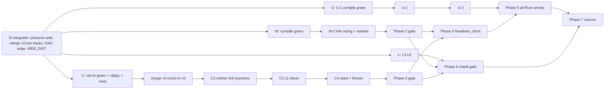

# Roost v3 — full Rust rewrite (re-plan: parallel tracks to parity)

## Context

Roost v2 (Bun + TypeScript + SolidJS) stays on `main` at `~/repos/roost` (reference only; uncommitted user edits in `GETTING_STARTED.md`, `deploy-local.ts`, `keeper-admission-staging*.ts` — never touch). Roost v3 is the complete Rust rewrite on `v3` (`~/repos/roost-v3`, `a464fa3e`, clean) with four track worktrees. Wave 0 is done; every track is mid-wave. This plan finishes the programme from the measured state below, maximally parallel (cost irrelevant; the machine — 8 cores, 31 GiB RAM, 18 GiB free disk, floor 10 GiB — is the limit). Line-count optimisation stays deferred to Phase 7.

End state: every phase gate green on the all-Rust stack, TS product code deleted, `v3.0.0` tagged and cut over.

## Fixed decisions (unchanged from the original plan)

- Backend: tokio, axum 0.8, official `connectrpc` (+build), `buffa` only protobuf runtime, sqlx sqlite, tracing JSON, thiserror in libs, anyhow only in binary mains, clap derive. Web: Dioxus 0.7.10 (web target) + framework-free `web-sys` terminal painting. Terminal core `alacritty_terminal` (patched in `third_party/`). PTY `portable-pty`. Worker WebRTC `str0m` 0.23.1; browser WebRTC `web-sys` `RtcPeerConnection`. `regex`, `web-push`, hand-rolled Ed25519 JWS, reqwest/tokio-tungstenite with rustls, pulldown-cmark + ammonia, `qrcode`, `idb` + WebCrypto non-extractable keys, `rust-embed`. All already pinned in root `Cargo.toml` `[workspace.dependencies]`.
- Wire contract `protocol/proto/roost/v1/*.proto` + `protocol/spec/*.md` byte-exact through Phase 6 (mixed Rust/TS stacks must interoperate in tests).
- Linux + macOS only; Windows paths not ported. Legacy drop rule: port only paths reachable in an all-v3 fleet; every dropped path is named in its commit body.
- `smoke/` stays TypeScript (Playwright oracle, 70 specs in `smoke/terminal/`). Stable toolchain pinned `1.98.1` (`rust-toolchain.toml`), `dx` 0.7.10 installed, `wasm32-unknown-unknown` installed.
- Crate DAG enforced by `xtask/src/crate_dag.rs` (unchanged, plus the one addition in Track L below).

## Measured state (this re-plan)

| Track | Branch @ HEAD | State | Remaining |
|---|---|---|---|
| Integrator | `v3` @ `a464fa3e` | clean; workspace gate 1420/0/0; `xtask lint` 865 inputs / 0 violations; link codec byte-exact vs TS; TS baseline 142 passed / 0 failed / 6 skipped | merges, `ROOST_SMOKE_WEB_DIST`, crate-DAG edge, phase gates |
| C coord | `v3-coord` @ `7a878523` (ahead 22 / behind 63) | C0 + C1 (13 slices) done; suite 613 passed / 6 failed / 3 ignored (5 failing binaries), two identical runs; 7 clippy lints | 6 failures, 7 lints, mutation rows, C2 keystone, C3, C4; 31 `AwaitingDomainPort` rows, 48 `delegated_*` arms |
| keeper | on `v3` via `be68afa0` | 131 passed / 0 failed / 22 binaries | keeper M1 mutation row (did not bite: test does not test the property) |
| W worker | `v3-worker` @ `4c559acd` (19 / 73) | W-0 + W-1 committed as preservation commit; **42 compile errors**; 4 `UNIMPLEMENTED:` (`runtime/link_wire.rs:39`, `runtime/mod.rs:148,180`, `runtime/snapshot_source.rs:39`) | compile to green, `session/emit.rs` over cap, W-2, audit residue |
| U web | `v3-web` @ `ced98ab4` (1 / 84) | U-0 committed; **41 uncommitted U-1 files (~7k lines, never compiled)** incl. `crates/roost-protocol/src/wire/agent_status{.rs,/order.rs}` (integrator-owned) | preserve, compile, renderer R1, U-2, U-3 |
| L cli | `v3-cli` @ `d8e0857b` (11 / 84) | L1 `deploy`/`keeper-refresh` done, dry-run 6 defects / 5 fixed | fresh-host deploy blocked on worker `ENV_BOOTSTRAP_TOKEN` redemption (W-2); L2–L6 |

Behind-counts are almost entirely `v3` docs commits; merges are cheap.

## Approach

### Topology (unchanged roles, current dependency graph)

1. **Roles.** Integrator (top-level session) owns `v3`, `crates/roost-protocol`, `crates/roost-proto`, root `Cargo.toml`/`Cargo.lock`, `xtask/`, `smoke/`, `.github/`, all merges and phase gates. One track lead (`task` agent) per track owns its composition roots, `cargo fmt`, the track gate, and commits/pushes its branch (`<area>: <scope>` + why-body). Slice agents own disjoint file sets, never commit, never run `cargo fmt` or `--update-*-baseline`, report every out-of-ownership edit. `agent://CoordIntegrate` (idle, holds the coord queue) is reused as Track C lead.
2. **Spawn shape.** The integrator spawns all four leads in ONE `tasks[]` batch right after I0; each lead fans its current wave's slices in one nested batch. If nested spawning is unavailable, the integrator spawns slice agents directly per track (same briefs) and leads act as per-track integrators. ≤32 concurrent agents; excess queues.
3. **Build isolation.** Every cargo command: `export PATH="$HOME/.cargo/bin:$PATH" CARGO_INCREMENTAL=0 CARGO_BUILD_JOBS=2`, `CARGO_TARGET_DIR=<worktree>/target-track` (integrator: `~/repos/roost-v3/target-gate`, `CARGO_BUILD_JOBS=8`, only when `pgrep -x cargo` is empty). Disk guard before each build: < 10 GiB free → delete `*/debug/incremental` and `*/debug/build/*/out` in all `target-*`; still < 10 GiB → `cargo clean` own `target-track` and report; still short → pause Track L builds, then Track U. `write`/`edit` resolve relative paths against v2: every brief says **absolute paths under the agent's own worktree only**.
4. **Snapshot rule.** Before any build longer than a few minutes, a lead with uncommitted wave work runs `git stash create` → `git push origin <sha>:refs/heads/<branch>-snap` (overwrite). A wave's output is committed (preservation commit allowed, body states it does not compile and lists measured errors) before the lead's context ends.
5. **Brief template** (every slice brief): `# Target` (worktree, owned files, TS files ported, non-goals); `# Read first` (TS module + tests, `docs/FAILURE-INDEX.md` grep, track contract: coord `docs/phase3-coord-contract.md`, worker `protocol/spec/{worker-link,keeper}.md`, cli `docs/phase6-cli-contract.md`, web `apps/web/src/smoke/smokeTypes.ts` + CLAUDE.md design system; `docs/v3-wave-gate.md` always); `# Rules` (CLAUDE.md: ≤400 lines incl. inline tests, `//!` 3–6 line header, no `macro_rules!`, no top-level mutable state, no `unwrap`/`expect` outside tests, `tracing` per transition, reuse named seams, no stubs/`todo!()`/`UNIMPLEMENTED:`); `# Verify` (`cargo check -p <crate> --all-targets`, owned test binaries alone, one mutation per behaviour test file per `docs/v3-wave-gate.md`); `# Report` (files + line counts, new pub symbols, unported TS exports + reason, FAILURE-INDEX guards moved, edits needed outside ownership).
6. **Measurement + mutation discipline** = `docs/v3-wave-gate.md`, verbatim: a published figure names its tree, comes from two agreeing `--no-fail-fast` runs (disagreement → publish the range), with `Running`/`test result` line counts; no concurrent cargo in the measured target dir; mutation windows announced before/after, backup outside the worktree + `trap` restore + sha256 check, green baseline for the named binaries, each row states must-fail AND must-still-pass, non-compiling mutation = INCONCLUSIVE, a row on a red test = BIT-with-unestablished-isolation. Every hold carries CHOSEN / OUT OF CLOCK / NOT MINE TO DECIDE.

### I0 — integrator, first, ~minutes (everything else waits only on its own line)

1. **Preserve web.** In `~/repos/roost-v3-web`: move the two `crates/roost-protocol/src/wire/agent_status*` edits out (`git diff -- crates/roost-protocol > /tmp/u1-protocol.patch`, copy `agent_status/order.rs` to `/tmp`, `git checkout -- crates/roost-protocol/src/wire/agent_status.rs`, remove `order.rs`); commit the rest as `web: U-1 client-core preservation — does not compile` (body: file list, "never compiled"); push. Apply the protocol patch on `v3` (integrator owns it), `cargo test -p roost-protocol` + wasm build, commit `protocol: agent-status ordering for the client replica`, push.
2. **DAG edge + deps for L5.** On `v3`: `xtask/src/crate_dag.rs` allow `roost-cli → roost-proto`; root `Cargo.toml` enable the `connectrpc` client feature; xtask test for the edge; commit + push.
3. **`ROOST_SMOKE_WEB_DIST`.** `smoke/terminal/stack-runtime.ts:277`: `process.env.ROOST_SMOKE_WEB_DIST ?? <current default>`; `bun run test:terminal` on the TS stack still 142/0/6; commit + push.
4. **Merge `v3` into every track** (`git merge v3` in each worktree; conflicts in track-owned files → that lead, else integrator); push each. Spawn the four leads (one batch).

### Track C — coordinator (`~/repos/roost-v3-coord`, lead `CoordIntegrate`)

**C5 — red to green (parallel, 4 slices + lead):**
| Slice | Target | Done when |
|---|---|---|
| F-ADAPT | `sync_feed_adapters` 2 failures: live defect at `:81`; `:53` (guarded by C10) | both pass; C10 row re-run on the green binary and re-recorded |
| F-ORDER | `agent_status_ordering` 1: deletion leaves the row present/misordered | passes; mutation row on the guarded line |
| F-VOL | `sync_feed_volatile::presence_reaches_every_viewer_except_the_one_that_authored_it` | passes; mutation row |
| F-SEC | `middleware_security_headers::a_relaxed_policy_adds_plaintext_endpoints_and_nothing_else_changes` | passes; M1-MOUNTED/M1-PREFLIGHT rows run on the green binary |
| lead | 7 clippy lints: `auth/cf_access.rs` empty line after doc comment, `agents/rpc_status.rs:124` redundant closure, `agents/status_order.rs:117` collapsible if, `auth/pairing/authority.rs` unneeded `Ok`/`?` (CHOSEN: remove), `terminal_view/registry.rs:307`, `install_cloudflare_jwks` `Result<(), ()>` (CHOSEN: typed `thiserror` error naming the failure) | `cargo clippy -p roost-coord --all-targets -- -D warnings` = 0 |

`mcp_relays_authority` (Internal-for-Unavailable) stays red: NOT MINE TO DECIDE (changes client retry behaviour) — surfaced to the user in the final report, not blocking any other step.

**C5-rows — parallel with C5, one agent per group, each on a green baseline binary:** C1, C6, C7, C8, C9; A1-1..A1-10 (A1-7 recorded UNWRITABLE with reason); TV-CLOSE; keeper M1 (write the test that tests the property, then re-run the row). Rows on binaries still red wait for their C5 slice. Results appended to `docs/v3-wave-gate.md` row table by the lead.

**C5 gate → merge.** Two agreeing `cargo test -p roost-coord --no-fail-fast` runs (expected: all pass except the held `mcp_relays_authority` 1), clippy 0, `cargo xtask lint` 0, fmt; commit, push; integrator merges `v3-coord` into `v3` (workspace gate) and `v3` back into `v3-coord`. This is the first coord checkpoint on `v3`.

**C2 — keystone (2 agents, after merge):** WL1 `worker_link/{connection,frame_queue,keepalive,conn_types}.rs` + real `/ws/worker` upgrade in `http/listener.rs` (lead yields it): generation admission via `upgrade_admission`, `announced_barrier`, `rate_window`, the `v3` link codec, ordered frame queue, keepalive/half-open detection, close codes per contract §7.6. WL2 `worker_link/frame_dispatch*.rs`: durable frames → `EventLog::append_event` (one-at-a-time `client_seq` ACK), live frames → `byte_hub`/`views`/buses, `rpc-ok`/`rpc-error` → `terminal_screen::pending_rpcs`, terminal_view `worker_link.rs` sink. Ports `apps/coord/src/workers/{worker-conn,worker-ws-handler,worker-ws-upgrade,worker-frame-dispatch,worker-frame-queue,worker-conn-keepalive,worker-conn-types}.ts`. WL2 codes against WL1's `conn_types.rs` stated in WL1's first message. Also wires rows `WorkersHeartbeat`, `WorkersRename`, `WorkersDelete`.

**C3 — parallel after C2 (11 slices):**
| Slice | Owns (`crates/roost-coord/src/`) | Ports (`apps/coord/src/`) | Rows |
|---|---|---|---|
| S4 session lifecycle | `sessions/{spawn,pending_spawns,list_projection,input,rpc}.rs` | `sessions/{handlers-sessions,handler-session-spawn,pending-spawns,session-list-projection}.ts` | `SessionsList/Spawn/Attach/Kill/Rename/Input/CursorPos/AssignWorkspace/GrantLocalTerminal/NegotiateLocalTerminalPeer` |
| S5 scrollback rows | `sessions/rpc_scrollback.rs` | scrollback handlers | `SessionsGetScrollbackCells/SearchScrollback/CancelScrollbackSearch` over `terminal_screen` |
| AT1 grants | `attachments/{grant,grant_state,rpc_direct}.rs` | `attachments/{attachment-grant-owner*,handlers-attachments-direct,worker-send-attachment-grant,worker-conn-attachment}.ts` | `AttachmentsGrantDirect`, `AttachmentsDirectStatus` |
| AT2 peer | `attachments/{peer_negotiations,rpc_peer}.rs` | `attachments/{attachment-peer-negotiations,handlers-attachments-peer,worker-send-attachment-peer,worker-frame-dispatch-direct-attachment}.ts` | `SessionsNegotiateAttachmentPeer` |
| AT3 files | `attachments/{files,status_results,rpc}.rs` | `attachments/{handlers-attachments,worker-send-attachment-status,attachment-direct-status-results}.ts` | `Files*` + attachment rows |
| AG2 prompt | `agents/{prompt_control,rpc_prompt}.rs` | `agents/{agent-prompt-control,handlers-agent-prompt,worker-agent-status-frame}.ts` | `SessionsPrompt` |
| X1 audit/metrics | `diagnostics/{audit_list,metrics,diag_log,rpc}.rs` | `rpc/handlers-system.ts` parts, `diagnostics/telemetry.ts` | `AuditList`, `MiscMetrics`, `DiagDebugLogBatch` |
| X2 diag snapshot | `diagnostics/{diag_snapshot,worker_results,session_state}.rs` | `diagnostics/{worker-diag-snapshot,diag-snapshot-worker-results,diag-snapshot-session-state}.ts` | `DiagSnapshot` |
| D1 POSIX deploy | `deploy/{jobs,catchup,rpc_deploy}.rs` | `deploy/{deploy-jobs,handlers-workers-deploy,worker-catchup-deploy}.ts`, `workers/worker-send-maintenance.ts` | `WorkersDeployStart/Output` (Windows half dropped, named in commit) |
| GS global search | `search/*` | `search/*.ts` (reuse `terminal_screen::search_ledger`) | `SessionsSearchGlobal`, `SessionsCancelGlobalSearch` |
| SY2 sync socket | `sync_ws/{socket,driver,state,queue,control,ingress}.rs` + real `/ws/coord-sync` upgrade | `sync/{sync-ws-handler,sync-ws-upgrade,sync-ws-v2-egress,sync-ws-v2-control,sync-ws-client-ingress,sync-ws-v2-state*,sync-ws-v2-queue,sse}.ts` | drives the pure `sync_ws` session |
| lead: HTTP tail | `http/listener.rs` | `bun-coordinator-listeners.ts` | SPA fallback on `config.web_dist_path`; `/api/db-export`; `MiscDbExportUrl` locality (`caller_of` + locality check, closes the OUT-OF-CLOCK hold) |

Any row the grep still shows after C3 is assigned by the lead to the slice owning its domain before C4 starts.

**C4 — after C3:** SY3 `sync_ws/{seed,v1_delivery,v1_seed,ui_settle}.rs` (ports `sync/{sync-feed,sync-feed-seed,sync-feed-v1-seed,sync-ws-v1-delivery}.ts`) incl. §12.8b announcement fence: un-ignore the two `sync_v2_send_queue` fence tests (must pass); un-ignore `push_sender_bounds::a_transition_superseded_while_the_batch_is_running_stops_further_sends` by injecting the transport's completion order (assertion unchanged). Coord new-behaviour check: release `roost coord` answers `AuthMintBootstrap` with the TS coord's status; `live-stack.ts` with `ROOST_SMOKE_COORD_EXECUTABLE` prints `READY` and a browser pairs.

**Track C done:** `AwaitingDomainPort` count 0; only `UnwiredInV2` rows and the retired Connect `Sync` use `delegated_*`; `ignored` = 0 in roost-coord; two agreeing green runs (sole exception: the held `mcp_relays_authority` if the user has not decided); integrator merges, Phase 3 gate.

### Track W — worker (`~/repos/roost-v3-worker`)

**W-C — compile to green (parallel, 4 slices by error cluster; measured in `4c559acd` body):**
| Slice | Files | Errors |
|---|---|---|
| WC-session-a | `session/{snapshot_cursor,cell_sink,types,spawn}.rs` | 12 |
| WC-session-b | `session/{emit,respawn,resize,lifecycle}.rs`; split `session/emit.rs` under 400 (sibling `impl` files) | 12 |
| WC-pool | `keeper_pool/dispatch.rs`, `runtime/keeper_probe.rs` (E0616 private `KeeperPool` fields → accessor methods on the pool, not `pub` fields) | 6 |
| WC-host | `host/{sampling,openssh_key,install,identity}.rs`: `InstallError` variants the tests expect (add only if the TS `install.ts` has the failure; else fix the test); **`WorkerOverrides::fingerprint` stays deleted — update the test** | 8 |

Lead: then clippy 0, lint 0, `cargo test -p roost-worker -p roost-keeper -p roost-term --no-fail-fast` two agreeing runs; red tests triaged into W-2 slices or fixed; W7 (agents) and the roost-term row finished; commit, push, integrator merges `v3-worker` into `v3`.

**W-2 — parallel after W-C (5 slices):**
| Slice | Owns | Delivers |
|---|---|---|
| L1 link wiring | `runtime/link_wire.rs`, `runtime/link_drain.rs` | real `LinkWire` over the `v3` codec; hello sends `capabilities` + `process_epoch`; `link_drain` dispatches browser commands to `browser_commands::Deps` (no refusal path left) |
| L2 snapshot/reconcile | `runtime/snapshot_source.rs`, `runtime/reconcile.rs` | ports `snapshot.ts`, `boot/boot-reconcile.ts`, `boot/boot-session-reconcile.ts`; closes `runtime/mod.rs:180` |
| L3 senders + store | `runtime/senders/*`, `event_store.rs` SQLite half | `transport/heartbeat.ts`, `coord-link-{agent-status,terminal-metadata,keeper-update}.ts`; `session-event-outbox.sqlite` FULL sync, DELETE journal |
| L4 bootstrap redemption | `runtime/bootstrap_redeem.rs` | `ENV_BOOTSTRAP_TOKEN` read at point of use (CHOSEN: not stored in `WorkerBoot`), redeemed via `AuthRedeemWorker`, key persisted; unblocks CLI fresh-host deploy |
| L5 residue | `keeper_pool/*` admission, keeper socket capability auth, `roost-term` TerminalCore sync-output + unhandled-sequence members | keeper env admission; socket capability check fail-closed; the two TerminalCore members with tests |
| lead | `runtime/mod.rs`, `bin/roost-worker.rs`, `browser_commands/mod.rs` `Deps` | v2 `main.ts` order: door (closes `:148`) → session manager → agents → heartbeat → link → reconcile → snapshot → `Readiness::advance(Reconciled)`; every `Deps` trait has a production impl |

**Track W done:** `UNIMPLEMENTED:` count 0; no test fake is the sole impl of a `Deps` trait; two agreeing green runs of worker/keeper/term; Phase 2 gate spec "browser smoke flow creates and cleans its resources" passes with the Rust worker.

### Track U — client core + web (`~/repos/roost-v3-web`)

**U-1c — compile the preserved U-1 (parallel, 4 slices + renderer):** UC-client (`src/client/*` + `auth_*`, `connect_interceptor`, `sync_*` tests), UC-store (`src/store/*`, `store.rs`, `effect.rs` + `store_*`, `prefs_*`, `palette_*`, `navigation_*` tests), UC-layout (layout tests + `tests/layout_support/`), UC-search (`src/search/*`, `search.rs` + `global_search_*`, `browse_*`, `agent_status_*` tests); lead owns `lib.rs`, `Cargo.toml`, `tests/support/mod.rs`. R1 cell renderer core (`crates/roost-web-terminal`: ONE `CellGridRenderer`, methods split across sibling `impl` files, never an exemption) runs concurrently. Gate: `cargo test -p roost-client-core --no-fail-fast` two agreeing runs, wasm build of client-core, `cargo tree -p roost-client-core -e normal | grep -c web-sys` = 0; commit, push, integrator merges.

**U-2 — parallel after U-1c:** A1 WebRTC carrier (logic in client-core, `RtcPeerConnection` in `roost-web/src/platform/`), A2 loopback/local-first + outbound sync, A5 attachments, A7 predictive echo/input; R2 scheduler/backfill/preview/snapshot facade, R3 input/IME controller, R6 incident capture; web S1 app shell + routes (`/`, `/s/:sessionId`, `/t/:workerFp/*folderPath`, `/settings/:pane?`, `/pair`, `/help`, `/design`) + md primitives. TS sources as in the U-2 list of `apps/web/src/{client,store,renderer}`.

**U-3 — parallel after U-2:** terminal glue, Settings panes, pairing/onboarding, browse/machines/agents/search, notifications/palette/toasts, voice + static assets (`public/sw-push.js`, `manifest.webmanifest`, AudioWorklet as-is), A10 `window.__smoke` behind feature `smoke` with the exact names/shapes of `apps/web/src/smoke/smokeTypes.ts`, installed only when `localStorage.roostSmoke === "1"`. Keep every `data-testid` and DOM class contract (`div.wterm.cell-grid`, `.cell-scrollback`, `.cell-viewport`, `.cell-row`, `.cell-find-hit`, 250-row blocks, ≤2,000 held rows). Each UI slice ends with a `browser` visual check against `/design` and the `design-reviewer` agent.

### Track L — CLI (`~/repos/roost-v3-cli`)

**L-2 — parallel now (4 slices):** L2 `push` (one journaled fleet transaction over L1's journal API); L3 `quickstart`/`join`/`add-machine` (systemd `roost3-coord.service`/`roost3-worker.service`, launchd `com.roost.coordinator-v3`/`com.roost.worker-v3`, `~/.local/bin/roost3`, `roost self-link`); L4 `update` (POSIX atomic self-replace, `posix-self-update-journal.ts`); L5 `api <verb>` over generated Connect types (after I0 step 2 merged); L6 `dev` (coord + worker + `dx serve`, SIGINT fan-out). Lead fixes the 6th L1 dry-run defect or records its hold state. Fresh-host `deploy` re-verified after W-2 L4 lands on `v3`.

**Track L done:** `command_tree_shape.rs` asserts all 21 subcommands; two agreeing green `cargo test -p roost-cli` runs; clippy/lint 0.

### Cross-track gates (integrator on `v3`, in order of availability)

- **TS baseline** (recorded, Wave 0): 142 passed / 0 failed / 6 skipped. "Passes" below means no spec fails that passes in this baseline.
- **Phase 2** (after Track W merge): `cargo build --release -p roost-cli -p roost-keeper` then `ROOST_SMOKE_WORKER_EXECUTABLE=$PWD/target-gate/release/roost bun run test:terminal`.
- **Phase 3** (after Track C merge): same with `ROOST_SMOKE_COORD_EXECUTABLE` only, then with both env vars.
- **Phase 4**: a `roost-client-core` integration test the integrator writes after W+C merge — in-process Rust coord + worker in temp dirs, tokio impls of the platform traits in `tests/support/`, pair a device, spawn a session, send `echo MARKER\n`, assert the replica viewport contains `MARKER`. It is not written on this branch; the gate `docs/phase4-client-contract.md` §1 defines, the `wasm32` build with no `web-sys` plus `crates/roost-client-core/tests/core_without_a_browser.rs`, is green.
- **Phase 5**: `dx build --release -p roost-web --platform web --features smoke`; all three `ROOST_SMOKE_*` set → full suite on Chromium + Firefox; production build without `smoke`: `grep -c __smoke` over the bundle = 0.
- **Phase 6**: scratch Linux user: `roost3 quickstart` installs+starts both units, `roost3 status` healthy coord/worker/keeper, paired browser opens a terminal, `roost3 deploy localhost` of a second build keeps the keeper PID when the `roost-keeper` digest is unchanged.

### Phase 7 — delete TS, size-policy review, release, cutover

1. `git rm` `apps/{coord,worker,web,roost-cli}`, `packages/`, product `scripts/*.ts`, root workspaces except `smoke`; remove TS CI jobs; `test:terminal` always runs the Rust stack.
2. **Rust size-policy review (the deferred decision).** Measure: histogram of `.rs` line counts, share of lines inside `#[cfg(test)]` modules, files split only to satisfy the cap. Present the user two options — (a) keep 400 counting all lines, (b) count only non-`#[cfg(test)]` lines — with the numbers; implement the chosen one in `xtask/src/file_size.rs`; any refactor it implies is its own commit series.
3. Upgrade tier Rust→Rust (`smoke/upgrade/`, previous `v3.*` tag vs working tree, keeper PID/channel continuity), `release.yml` for `v3.*` (Linux x86_64/aarch64, macOS x86_64/aarch64, SHA-256 assets).
4. Rewrite `ARCHITECTURE.md`, `crates/*/README.md`, `GETTING_STARTED.md`; tag `v3.0.0`; side-by-side production install (4113/door 4114), fresh pairing/joins, repoint front door, disable v2 units, `roost self-link`.

## Critical files & anchors

- `crates/roost-coord/src/rpc/service_impl.rs` + `rpc/method_route_rows.rs` — the wiring and coverage contract every coord slice lands through (lead-only).
- `crates/roost-coord/src/http/listener.rs` — yielded by the lead to WL1 (C2), then SY2 (C3), then back to the lead for the HTTP tail; never two owners at once.
- `crates/roost-worker/src/runtime/{mod.rs:148,180,link_wire.rs:39,snapshot_source.rs:39}` and `browser_commands/mod.rs` `Deps` — the four `UNIMPLEMENTED:` sites and the constructor W-2 closes.
- `crates/roost-protocol/src/wire/coord_worker.rs` + `proto_adapters/` — the landed link codec both backend tracks consume.
- `docs/v3-wave-gate.md` — the measurement/mutation rules and the row table every lead appends to.
- `smoke/terminal/stack-runtime.ts:277`, `apps/web/src/smoke/smokeTypes.ts` — the web-dist override and the smoke backdoor contract.

## Verification

- Per wave checkpoint: two agreeing `--no-fail-fast` runs for the track's crates, clippy `-D warnings` 0, `cargo xtask lint` 0 with its `checked N inputs` line, before the lead commits; the integrator re-runs the workspace gate on `v3` after each merge.
- Coord new-behaviour checks after C2/C3: with a release `roost coord` on `127.0.0.1:<port>`, `curl -s -o /dev/null -w '%{http_code}' -X POST -H 'content-type: application/proto' http://127.0.0.1:<port>/roost.v1.CoordinatorService/AuthMintBootstrap` returns the same status as the TS coord for the same request; `bun smoke/terminal/live-stack.ts` with `ROOST_SMOKE_COORD_EXECUTABLE` prints `READY` and a browser pairs.
- Worker new-behaviour check after W-2: Phase 2 gate spec `terminal-delivery.spec.ts` "browser smoke flow creates and cleans its resources" passes with the Rust worker.
- Phase gates as listed under Cross-track gates; final: Phase 5 full suite on the all-Rust stack and the Phase 6 scratch-account scenario.

## Assumptions & contingencies

- Line count: only `service_impl.rs` is exempt now; the general Rust cap policy is decided by the user in Phase 7 step 2 with measurements. If a slice cannot keep a file ≤400 without contorting a single cohesive type (e.g. `CellGridRenderer`), split methods across sibling `impl` files in the same module (inherent impls may span files) — never a new exemption.
- If free disk drops below 10 GiB with all four tracks active: pause Track L builds first (smallest critical-path impact), then Track U.
- If nested task spawning is unavailable to track leads, the program integrator spawns all slice agents directly (same briefs, one batch per wave per track) and leads act only as per-track integrators.
- If `str0m` fails the peer specs against real browsers after configuration fixes: switch the worker peer to `webrtc` (webrtc-rs) behind the same internal trait. If `connectrpc` blocks a needed behaviour: implement Connect unary as axum handlers. If Dioxus blocks a UI behaviour: imperative `web-sys` widget mounted from a component.
- A track branch that falls >1 wave behind `v3` merges `v3` before starting its next wave; merge conflicts on files owned by that track are resolved by the lead, anything else by the integrator.

## Held for the user (surfaced in the final report; nothing waits on them)

- `mcp_relays_authority`: port returns `Internal` where v2 returns `Unavailable` — NOT MINE TO DECIDE (client retry behaviour).
- `agent_status_push::only_a_block_and_a_finished_turn_reach_a_phone` idle→blocked push: port matches v2 — NOT MINE TO DECIDE (product behaviour).
- `i64::MAX` `if_version` clamp (lossy, not wrong) and the process-wide `OnceLock` counter in `cf_access_keyring` tests — OUT OF CLOCK; picked up in Phase 7 size/cleanup pass.
- `bun_abi` unmodelled in `KeeperContractV1` — CHOSEN (no Bun in an all-v3 fleet).
