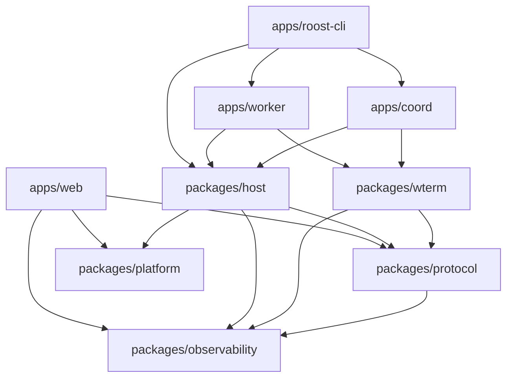

<!-- Protocol contract index: source of truth for language-neutral Roost v1 behavior. -->
<!-- TypeScript implementations import @roost/protocol; this tree defines their wire meaning. -->
<!-- Client implementers start with the endpoint manifest, then follow the linked surface spec. -->

# Roost protocol contract

## Layout

| Path | Owns |
| --- | --- |
| `protocol/proto/roost/v1/` | Language-neutral protobuf sources. Package `roost.v1`; regenerate TypeScript bindings with `bun run --filter='@roost/protocol' proto:gen`. |
| `packages/protocol/src/` | Browser-safe generated bindings, wire schemas, event fold, terminal-cell model, direct-peer framing, and portable contract policy. Import `@roost/protocol/<subpath>`; there is no barrel. |
| `protocol/spec/` | Normative state machines, limits, errors, and implementation anchors for each client-facing surface. |
| `protocol/conformance/` | Language-neutral vectors consumed by the final conformance runner. |

## Versioning

`protocol/proto/buf.yaml` configures Buf `version: v2`, lint `STANDARD` except `PACKAGE_VERSION_SUFFIX`, and breaking changes with `use: FILE`.

| Literal | Meaning | TypeScript source |
| --- | --- | --- |
| `attachment-transfer-peer-webrtc-v1` | Worker capability for the attachment-specific WebRTC carrier. | `packages/protocol/src/attachment-transfer.ts:6` |
| `roost-local-attachment-transfer-v1` | Worker loopback WebSocket subprotocol for attachment transfer. | `packages/protocol/src/attachment-transfer.ts:9` |
| `roost-attachment-control-v1` | Ordered attachment WebRTC control-channel label. | `packages/protocol/src/attachment-transfer.ts:62` |
| `roost-attachment-data-v1` | Ordered attachment WebRTC data-channel label. | `packages/protocol/src/attachment-transfer.ts:69` |
| `terminal-peer-webrtc-v1` | Worker capability for direct terminal WebRTC. | `packages/protocol/src/terminal-peer.ts:5` |
| `terminal-input-route-v1` | Worker capability for acknowledged direct-terminal input-route handoff. | `packages/protocol/src/terminal-peer.ts:6` |
| `roost-terminal-control-v1` | Direct-terminal WebRTC control-channel label. | `packages/protocol/src/terminal-peer.ts:94` |
| `roost-terminal-data-v1` | Direct-terminal WebRTC terminal-lane label. | `packages/protocol/src/terminal-peer.ts:100` |
| `roost-terminal-history-v1` | Direct-terminal WebRTC history-lane label. | `packages/protocol/src/terminal-peer.ts:106` |
| `schema_version` | Explicit schema discriminator for versioned non-proto payloads and observations. | `packages/protocol/src/agent-conversation-reference.ts:37`; `packages/protocol/src/keeper-update.ts:34`; `packages/protocol/src/layout-document.ts:91` |
| `protocol_version` | Keeper contract compatibility discriminator. | `packages/protocol/src/keeper-update.ts:18` |
| `sync_v` | Sync WebSocket negotiation discriminator; `2` selects domain generations and socket identity. | `packages/protocol/src/wire/sync-ws.ts:11` |

## Client endpoint manifest

| Surface | Path / label | Transport / auth | Defined in | Spec |
| --- | --- | --- | --- | --- |
| Connect-RPC | `POST /roost.v1.CoordinatorService/<Method>` | HTTPS; account-device or legacy-self-hosted JWT for protected methods; bootstrap/pair entry methods are separately authorized. | `protocol/proto/roost/v1/coordinator.proto`; `apps/coord/src/rpc/router.ts` | [`spec/coordinator-rpc.md`](spec/coordinator-rpc.md) |
| Sync WS | `/ws/coord-sync?tab=<id>&since=<id>&flow=1&sync_v=2` | WebSocket subprotocol `roost-auth`; account-device JWT; no `tab` means read-only. | `packages/protocol/src/wire/sync-ws.ts`; `apps/coord/src/sync/sync-ws-upgrade.ts` | [`spec/sync.md`](spec/sync.md) |
| Worker link WS | `/ws/coord-worker/<64-hex fingerprint>` | Raw full-duplex WebSocket; worker JWT and exact worker identity; not a client surface. | `protocol/proto/roost/v1/worker_transport.proto`; `apps/coord/src/workers/worker-ws-upgrade.ts` | [`spec/worker-link.md`](spec/worker-link.md) |
| DB export | `GET /api/db-export` | Operator HTTP surface; on-host/account-device gate. | `apps/coord/src/coord-factory.ts` | [`spec/coordinator-rpc.md`](spec/coordinator-rpc.md) |
| Worker local door | `127.0.0.1:4104`; `GET /api/local-bootstrap`; WS `/ws/local-terminal` with subprotocol `roost-local-terminal`; WS `/ws/local-attachment-transfer` with subprotocol `roost-local-attachment-transfer-v1` | Loopback only; exact coordinator-issued direct grant and descriptor. | `packages/protocol/src/local-ui-door.ts`; `apps/worker/src/local-ui-server.ts` | [`spec/direct-terminal.md`](spec/direct-terminal.md), [`spec/attachments.md`](spec/attachments.md) |
| Terminal WebRTC | `roost-terminal-control-v1`, `roost-terminal-data-v1`, `roost-terminal-history-v1`; protocol `roost.local-terminal.v1` | DTLS/SCTP; coordinator-admitted exact grant, worker epoch, peer tuple, and hello. | `packages/protocol/src/terminal-peer.ts`; `protocol/proto/roost/v1/local_terminal.proto` | [`spec/direct-terminal.md`](spec/direct-terminal.md) |
| Attachment WebRTC | `roost-attachment-control-v1`, `roost-attachment-data-v1`; protocol `roost.attachment-transfer.v1` | DTLS/SCTP; short-lived exact upload descriptor. | `packages/protocol/src/attachment-transfer.ts`; `protocol/proto/roost/v1/attachment_transfer.proto` | [`spec/attachments.md`](spec/attachments.md) |

## TypeScript package layering

An edge `A --> B` means A may import B.

Coordinator, worker, and CLI may also import protocol, platform, and observability directly. Future native clients live under `apps/<platform>` and depend only on `protocol/`. Import direction is enforced by `scripts/lint-boundaries.ts`.
